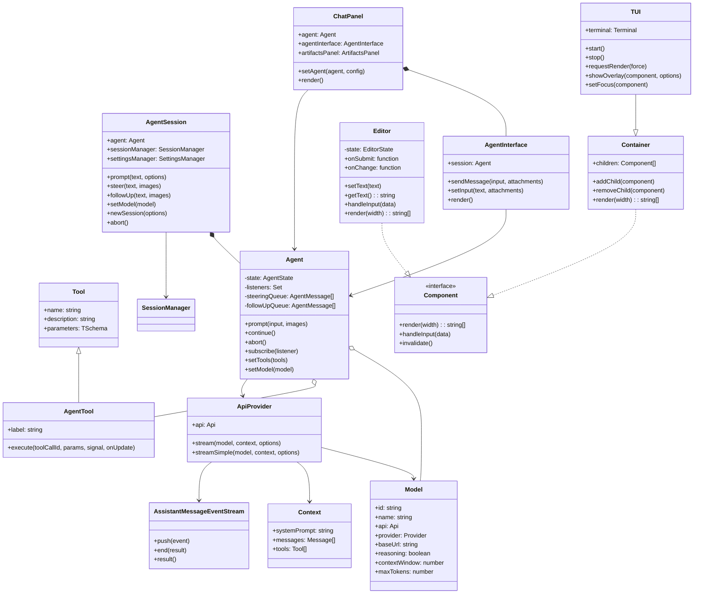
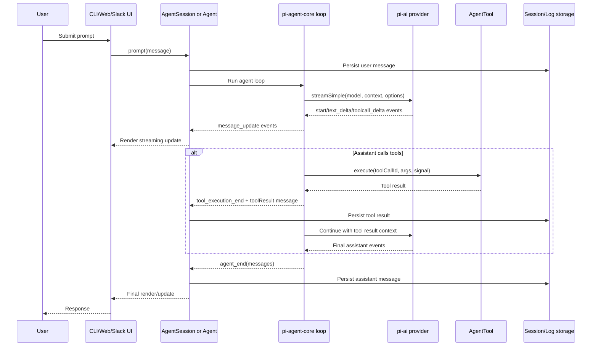
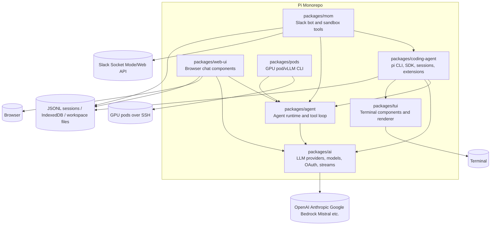
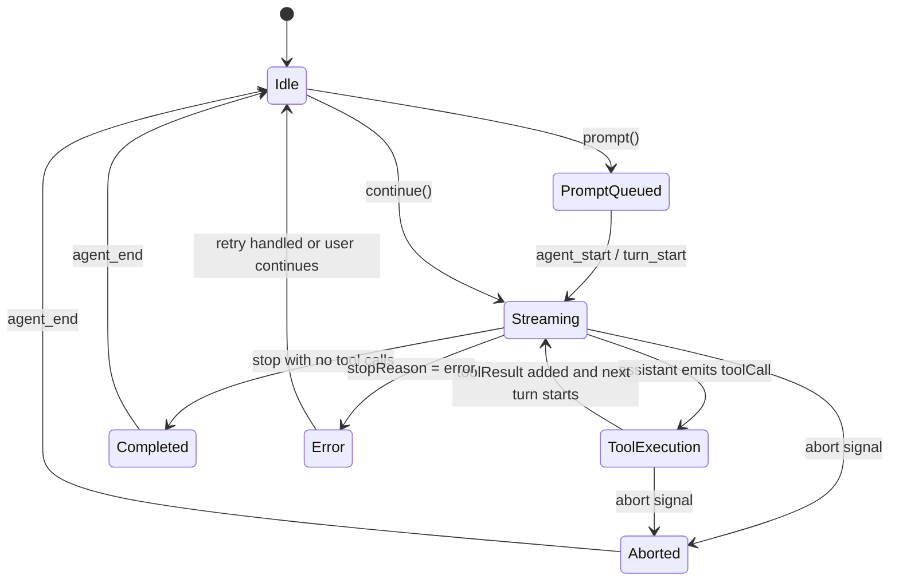

# Pi Monorepo

Pi Monorepo contains TypeScript packages for building AI agents, terminal coding workflows, reusable chat UIs, Slack-based agent automation, and GPU pod/vLLM deployment tooling.

## Table of Contents

- [Features](#features)
- [Architecture](#architecture)
- [Installation](#installation)
- [Usage](#usage)
- [API Reference](#api-reference)
- [Configuration](#configuration)
- [UML Diagrams](#uml-diagrams)
- [Contributing](#contributing)
- [License](#license)

## Features

- Unified multi-provider LLM API with streaming, tool calls, reasoning blocks, usage, and cost tracking.
- Stateful agent loop with tool execution, steering/follow-up queues, hooks, and event streaming.
- Interactive coding agent CLI with sessions, branching, compaction, extensions, skills, prompt templates, themes, and built-in file/bash tools.
- Terminal UI framework with differential rendering, overlays, editor, markdown, selection lists, images, and keybinding utilities.
- Web components for AI chat interfaces with attachments, artifacts, IndexedDB storage, custom providers, and browser proxy support.
- Slack bot (`mom`) that delegates messages to an agent, runs tools in host or Docker sandbox mode, persists channel history, and supports scheduled events.
- GPU pod manager for deploying and operating vLLM-backed OpenAI-compatible endpoints on remote machines.

## Architecture

This is an npm workspace monorepo written primarily in TypeScript and targeting Node.js 20+.

| Package | Purpose |
| --- | --- |
| `@mariozechner/pi-ai` | Provider/model registry, stream/complete APIs, common message/tool types, OAuth helpers, and provider implementations. |
| `@mariozechner/pi-agent-core` | Generic stateful agent runtime over `pi-ai`, with tool execution and observable events. |
| `@mariozechner/pi-coding-agent` | `pi` coding-agent CLI and SDK built on `pi-agent-core`, `pi-ai`, and `pi-tui`. |
| `@mariozechner/pi-tui` | Terminal rendering and component library used by the coding agent and standalone CLIs. |
| `@mariozechner/pi-web-ui` | Browser/web-component chat UI powered by `pi-agent-core` and `pi-ai`. |
| `@mariozechner/pi-mom` | Slack bot that wraps coding-agent session infrastructure for per-channel autonomous agents. |
| `@mariozechner/pi` | GPU pod/vLLM management CLI exposed as `pi-pods`. |

At runtime, most agent workflows follow this layering:

1. A UI/entrypoint accepts input (`pi` CLI, web component, Slack bot, or SDK).
2. `AgentSession` or `Agent` records a user message and emits lifecycle events.
3. `pi-agent-core` converts app messages to LLM messages, calls `pi-ai`, and executes requested tools.
4. `pi-ai` resolves the model API provider, streams standardized events, and returns an `AssistantMessage`.
5. The UI/session layer persists messages and renders updates.

## Installation

### Requirements

- Node.js 20+ for most packages.
- Node.js 20.6+ for `@mariozechner/pi-coding-agent`.
- npm workspaces.
- Provider credentials for LLM calls, depending on the selected model.

### From source

```bash
git clone https://github.com/badlogic/pi-mono.git
cd pi-mono
npm install
npm run build
```

### Development checks

```bash
npm run check
./test.sh
```

`npm run check` runs Biome, TypeScript checks, browser smoke checks, and web UI checks. Tests are run separately with `./test.sh`.

### Package installation examples

```bash
npm install @mariozechner/pi-ai
npm install @mariozechner/pi-agent-core
npm install -g @mariozechner/pi-coding-agent
npm install @mariozechner/pi-web-ui @mariozechner/pi-agent-core @mariozechner/pi-ai
npm install -g @mariozechner/pi-mom
npm install -g @mariozechner/pi
```

## Usage

### Coding agent CLI

```bash
export ANTHROPIC_API_KEY=sk-ant-...
pi
```

Common modes:

```bash
pi "List all TypeScript files in src/"
pi -p "Summarize this repository"
pi --mode json "Return event stream as JSONL"
pi -c
pi -r
```

### Core LLM API

```typescript
import { complete, getModel } from "@mariozechner/pi-ai";

const model = getModel("openai", "gpt-4o-mini");
const response = await complete(model, {
  systemPrompt: "You are helpful.",
  messages: [{ role: "user", content: "Hello", timestamp: Date.now() }],
});

console.log(response.content);
```

### Agent runtime

```typescript
import { Agent } from "@mariozechner/pi-agent-core";
import { getModel } from "@mariozechner/pi-ai";

const agent = new Agent({
  initialState: {
    systemPrompt: "You are a helpful assistant.",
    model: getModel("anthropic", "claude-sonnet-4-20250514"),
    tools: [],
  },
});

agent.subscribe((event) => console.log(event.type));
await agent.prompt("Hello");
```

### SDK session

```typescript
import { AuthStorage, createAgentSession, ModelRegistry, SessionManager } from "@mariozechner/pi-coding-agent";

const authStorage = AuthStorage.create();
const { session } = await createAgentSession({
  sessionManager: SessionManager.inMemory(),
  authStorage,
  modelRegistry: new ModelRegistry(authStorage),
});

await session.prompt("What files are in this directory?");
```

### Slack bot (`mom`)

```bash
export MOM_SLACK_APP_TOKEN=xapp-...
export MOM_SLACK_BOT_TOKEN=xoxb-...
export ANTHROPIC_API_KEY=sk-ant-...

mom --sandbox=docker:mom-sandbox ./data
```

### GPU pods CLI

```bash
export HF_TOKEN=your_huggingface_token
export PI_API_KEY=your_vllm_api_key

pi-pods pods setup dc1 "ssh root@1.2.3.4" --models-path /mnt/models
pi-pods start Qwen/Qwen2.5-Coder-32B-Instruct --name qwen
pi-pods agent qwen "What is the Fibonacci sequence?"
```

## API Reference

### `@mariozechner/pi-ai`

| API | Description |
| --- | --- |
| `getModel(provider, modelId)` | Resolve a known model from generated metadata. |
| `getModels(provider)` / `getProviders()` | Query registered model metadata. |
| `stream(model, context, options)` | Stream provider-specific `AssistantMessageEvent` values. |
| `complete(model, context, options)` | Collect a full assistant response. |
| `streamSimple` / `completeSimple` | Unified reasoning options over provider-specific APIs. |
| `registerApiProvider()` | Add custom API providers. |
| OAuth helpers | Login and token refresh helpers under `@mariozechner/pi-ai/oauth`. |

### `@mariozechner/pi-agent-core`

| API | Description |
| --- | --- |
| `Agent` | Stateful agent class with prompt/continue/abort and state mutators. |
| `agentLoop()` / `agentLoopContinue()` | Lower-level event streams for custom runtimes. |
| `AgentTool` | Tool interface with TypeBox parameters and async execution. |
| `beforeToolCall` / `afterToolCall` | Hooks for permissioning and result transformation. |

### `@mariozechner/pi-coding-agent`

| API/Command | Description |
| --- | --- |
| `pi` | Interactive, print, JSON, RPC, and export modes. |
| `createAgentSession()` | SDK factory for embeddable coding-agent sessions. |
| `AgentSession` | Session persistence, compaction, model/tool management, extension bindings. |
| Extensions API | Register tools, commands, UI, event hooks, and provider hooks. |

### `@mariozechner/pi-tui`

| API | Description |
| --- | --- |
| `TUI` | Root terminal UI container and differential renderer. |
| `Component` | Render/input/invalidate contract. |
| `Container`, `Text`, `Editor`, `Markdown`, `SelectList`, `SettingsList`, `Image` | Built-in UI components. |
| `matchesKey`, `Key` | Keyboard input abstraction. |
| `visibleWidth`, `truncateToWidth`, `wrapTextWithAnsi` | ANSI-aware layout utilities. |

### CLI commands

- `pi`: coding agent CLI (`packages/coding-agent`).
- `pi-ai`: OAuth/model utility CLI (`packages/ai`).
- `mom`: Slack bot (`packages/mom`).
- `pi-pods`: GPU pod/vLLM manager (`packages/pods`).

## Configuration

### LLM provider credentials

Common environment variables include:

| Provider | Environment variables |
| --- | --- |
| OpenAI | `OPENAI_API_KEY` |
| Azure OpenAI | `AZURE_OPENAI_API_KEY`, `AZURE_OPENAI_BASE_URL` or `AZURE_OPENAI_RESOURCE_NAME` |
| Anthropic | `ANTHROPIC_API_KEY` or `ANTHROPIC_OAUTH_TOKEN` |
| Google Gemini | `GEMINI_API_KEY` |
| Google Vertex | `GOOGLE_CLOUD_API_KEY`, or ADC with `GOOGLE_CLOUD_PROJECT` and `GOOGLE_CLOUD_LOCATION` |
| Amazon Bedrock | Standard AWS credentials and region settings |
| Mistral | `MISTRAL_API_KEY` |
| Groq | `GROQ_API_KEY` |
| Cerebras | `CEREBRAS_API_KEY` |
| xAI | `XAI_API_KEY` |
| OpenRouter | `OPENROUTER_API_KEY` |
| Vercel AI Gateway | `AI_GATEWAY_API_KEY` |
| MiniMax | `MINIMAX_API_KEY` |
| Kimi For Coding | `KIMI_API_KEY` |

### Coding agent configuration

- `PI_CODING_AGENT_DIR`: config directory, default `~/.pi/agent`.
- `PI_PACKAGE_DIR`: package directory override.
- `PI_SKIP_VERSION_CHECK`: skip startup version checks.
- `PI_CACHE_RETENTION`: set to `long` for extended prompt cache.
- `VISUAL` / `EDITOR`: external editor command.
- Project settings: `.pi/settings.json`.
- Global settings: `~/.pi/agent/settings.json`.
- Context files: `AGENTS.md` or `CLAUDE.md` in parent/current directories and `~/.pi/agent/AGENTS.md`.

### Mom configuration

- `MOM_SLACK_APP_TOKEN`: Slack app-level token.
- `MOM_SLACK_BOT_TOKEN`: Slack bot token.
- `ANTHROPIC_API_KEY`: optional if OAuth credentials are available through mom auth storage.
- Sandbox modes: `--sandbox=host` or `--sandbox=docker:<container>`.

### Pod manager configuration

- `HF_TOKEN`: Hugging Face token for model downloads.
- `PI_API_KEY`: API key configured for vLLM endpoints.
- `PI_CONFIG_DIR`: pod config directory, default `~/.pi`.

## UML Diagrams

### Class Diagram



### Sequence Diagram



### Component Diagram



### State Diagram



### Provider Registry Flow

```mermaid
flowchart LR
    Model[Model.api] --> Registry[getApiProvider(api)]
    Registry --> Builtins[register-builtins lazy providers]
    Builtins --> OpenAI[OpenAI Responses/Completions]
    Builtins --> Anthropic[Anthropic Messages]
    Builtins --> Google[Google Gemini/Vertex/CLI]
    Builtins --> Mistral[Mistral Conversations]
    Builtins --> Bedrock[Amazon Bedrock Converse]
    OpenAI --> Events[Standard AssistantMessageEvent stream]
    Anthropic --> Events
    Google --> Events
    Mistral --> Events
    Bedrock --> Events
```

## Contributing

See [CONTRIBUTING.md](CONTRIBUTING.md) for contributor guidelines. For repository-specific development rules and agent instructions, see [AGENTS.md](AGENTS.md).

Development workflow:

```bash
npm install
npm run build
npm run check
./test.sh
```

Do not commit generated build output. Package changelogs live in `packages/*/CHANGELOG.md`.

## License

MIT. See [LICENSE](LICENSE).
