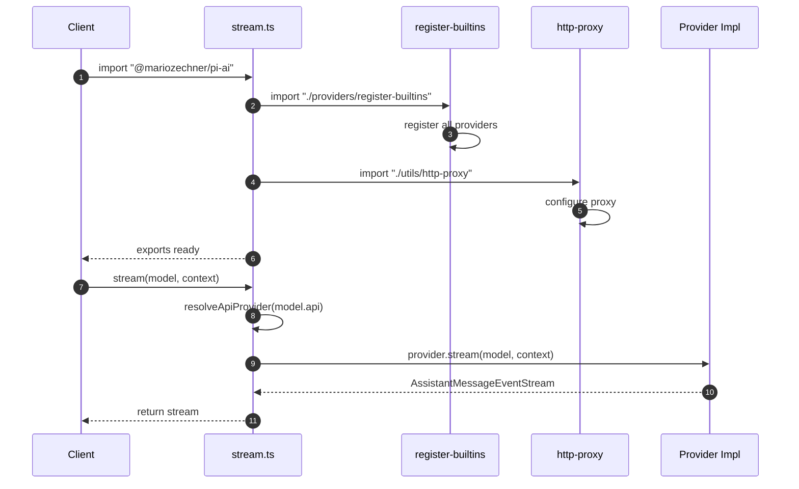

# stream.ts


Related: [[../../../00-start/home]] · [[../dashboard]] · [[api-registry]] · [[../../coding-agent/guides/providers]] · [[../../pods/guides/models]] · [[../../../02-api/coding-agent-extension-types]] · [[../../../10-mirrors/ai/api/packages_ai_src_stream]]

## Backlinks

- [[../../../10-mirrors/ai/api/packages_ai_src_stream]]
- [[../../../00-start/graph-index]]
- [[../../../00-start/dashboards]]


> Auto-generated documentation for `packages/ai/src/stream.ts`

## Overview

High-level streaming API for the pi-ai package. Provides unified `stream()` and `complete()` functions that route to provider-specific implementations via the API registry. Supports both advanced streaming with provider-specific options and simplified cross-provider streaming via `streamSimple()`/`completeSimple()`.

## Dependencies

| Import | Purpose |
|--------|---------|
| `./providers/register-builtins.js` | Ensures all built-in providers are registered |
| `./utils/http-proxy.js` | Side-effect: configures HTTP proxy support |
| `./api-registry.js` | `getApiProvider` for routing to correct provider |
| `./env-api-keys.js` | API key detection utilities |
| `./types.js` | All type definitions for streaming |

## API / Exports

### Main Streaming Functions

**`stream(model, context, options?)`** - Core streaming function

```typescript
function stream<TApi extends Api>(
  model: Model<TApi>,
  context: Context,
  options?: ProviderStreamOptions
): AssistantMessageEventStream
```

Routes to the registered provider's `stream` function based on `model.api`. Type-safe: `options` can include provider-specific parameters.

**Example:**
```typescript
const model = getModel("anthropic", "claude-sonnet-4-20250514");
const s = stream(model, {
  systemPrompt: "You are a helpful assistant",
  messages: [{ role: "user", content: "Hello!", timestamp: Date.now() }]
}, {
  thinkingEnabled: true  // Anthropic-specific option
});
```

**`complete(model, context, options?)`** - Promise-based completion

Returns `Promise<AssistantMessage>` - the final complete message from streaming.

```typescript
const response = await complete(model, context);
console.log(response.content[0].text);
```

### Simplified API

**`streamSimple(model, context, options?)`** - Cross-provider streaming

```typescript
function streamSimple<TApi extends Api>(
  model: Model<TApi>,
  context: Context,
  options?: SimpleStreamOptions
): AssistantMessageEventStream
```

Uses `reasoning` option instead of provider-specific thinking options:
```typescript
const s = streamSimple(model, context, { reasoning: "high" });
```

**`completeSimple(model, context, options?)`** - Promise-based with simple options

```typescript
const response = await completeSimple(model, context, { reasoning: "medium" });
```

### Environment Detection

**`getEnvApiKey(provider)`** - Re-export from env-api-keys

```typescript
import { getEnvApiKey } from "@mariozechner/pi-ai";
const key = getEnvApiKey("anthropic"); // Checks ANTHROPIC_API_KEY
```

## Internal Details

### Provider Resolution

The `resolveApiProvider(api)` helper function:
1. Calls `getApiProvider(api)` to look up registration
2. Throws descriptive error if not found: `No API provider registered for api: ${api}`

### Provider Stream Wrapping

Each registered provider's `stream` and `streamSimple` functions are wrapped with validation:
- Checks `model.api` matches expected API
- Casts model/context to appropriate types
- Returns `AssistantMessageEventStream`

### Side Effects

Module loading triggers:
1. `import "./providers/register-builtins.js"` - Registers all built-in providers
2. `import "./utils/http-proxy.js"` - Configures `globalAgent` HTTP proxy from env vars

This ensures providers are available without explicit registration in most use cases.

### Type Safety

The generic `TApi extends Api` ensures:
- Model's declared API matches provider implementation
- Provider-specific options are type-checked via `ProviderStreamOptions`
- Simple options use unified `SimpleStreamOptions` interface

## UML Diagrams

### Module Initialization Sequence



### Provider Routing

```mermaid
flowchart LR
    Call[stream() call] --> Check{resolveApiProvider}
    Check -->|not found| Error[Throw Error]
    Check -->|found ap:X| ProviderMap[API Provider Registry]
    ProviderMap -->|anthropic-messages| Anthropic[streamAnthropic]
    ProviderMap -->|openai-responses| OpenAIResp[streamOpenAIResponses]
    ProviderMap -->|openai-completions| OpenAIComp[streamOpenAICompletions]
    ProviderMap -->|...| OtherProviders
    
    Anthropic --> Result[AssistantMessageEventStream]
    OpenAIResp --> Result
    OpenAIComp --> Result
```

### Function Hierarchy

```mermaid
classDiagram
    class StreamAPI {
        +stream()
        +complete()
        +streamSimple()
        +completeSimple()
        +getEnvApiKey()
        -resolveApiProvider()
    }
    
    class APIRegistry {
        +registerApiProvider()
        +getApiProvider()
    }
    
    class ProviderImpl {
        +stream()
        +streamSimple()
    }
    
    StreamAPI --> APIRegistry : resolves
    APIRegistry .."> ProviderImpl : creates/returns
```