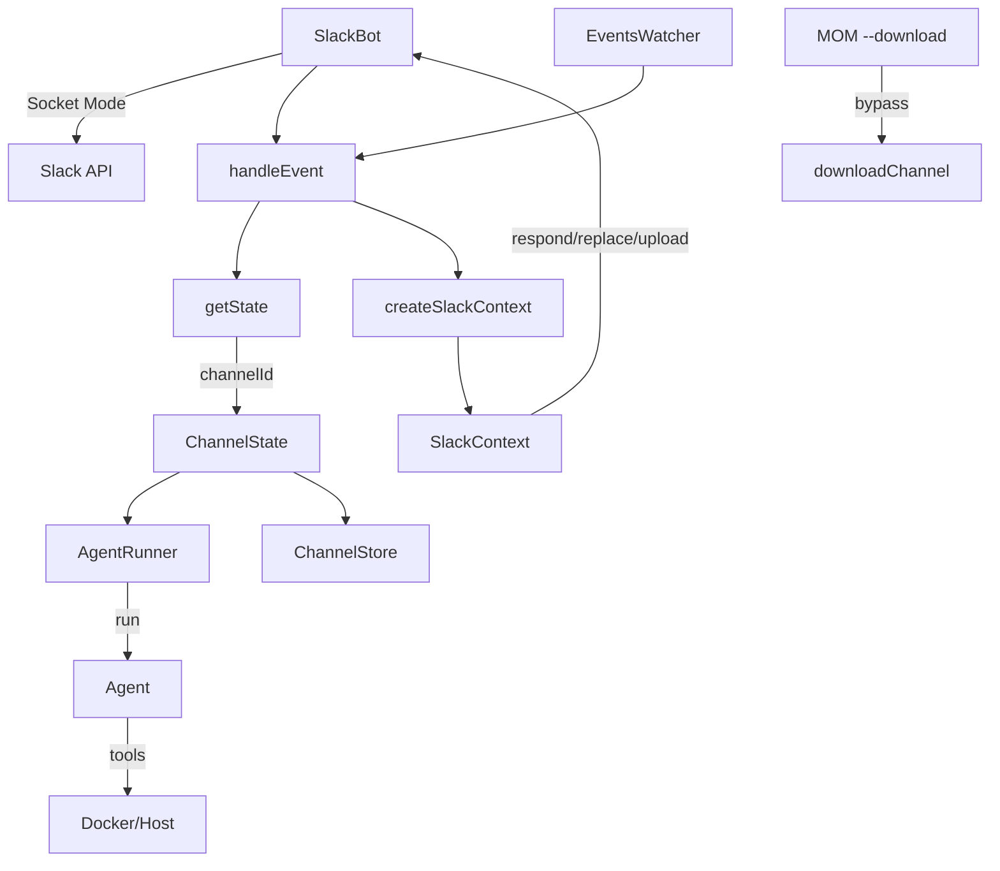
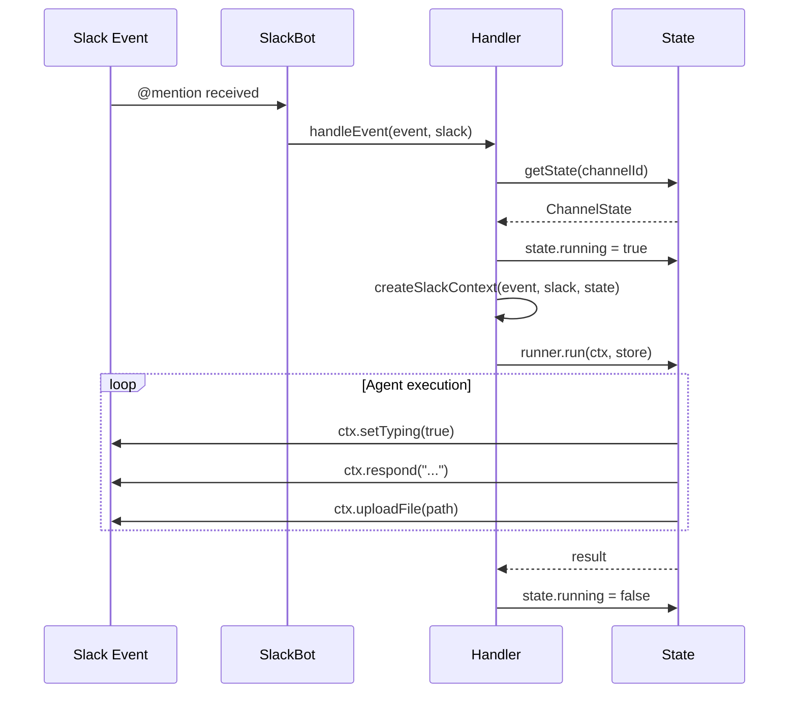
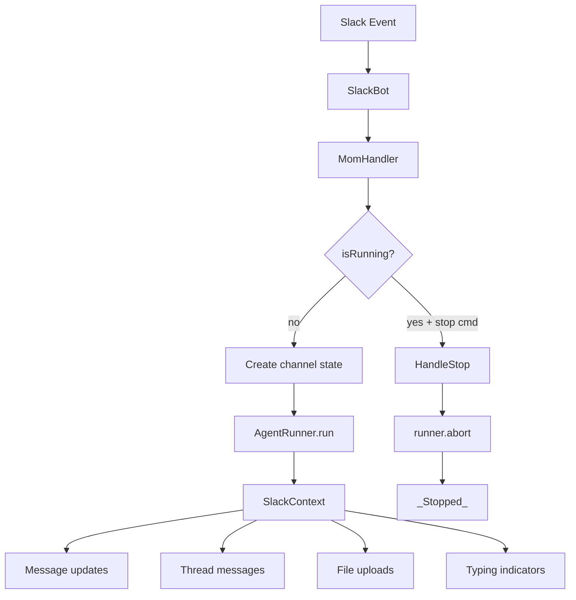

# main.ts


Related: [[../../../00-start/home]] · [[../home]] · [[../dashboard]] · [[../../../10-mirrors/mom/packages_mom_README]] · [[../guides/events]] · [[../guides/sandbox]] · [[../guides/artifacts-server]] · [[../guides/slack-bot-minimal-guide]] · [[../../../10-mirrors/mom/api/packages_mom_src_main]]

## Backlinks

- [[../../../10-mirrors/mom/api/packages_mom_src_main]]
- [[../../../00-start/graph-index]]
- [[../../../00-start/dashboards]]


> Auto-generated documentation for `packages/mom/src/main.ts`

## Overview

Main entry point for the pi-mom Slack bot. Manages per-channel state, handles Slack events via Socket Mode, coordinates agent execution via `AgentRunner`, and provides context adapters for Slack integration. Supports Docker sandbox mode for secure command execution.

## Dependencies

| Import | Purpose |
|--------|---------|
| `path` | Working directory resolution |
| `./agent.js` | `AgentRunner`, `getOrCreateRunner` |
| `./download.js` | `downloadChannel` for history export |
| `./events.js` | `createEventsWatcher` for scheduled events |
| `./log.js` | Logging utilities |
| `./sandbox.js` | `SandboxConfig`, `validateSandbox`, `parseSandboxArg` |
| `./slack.js` | `SlackBot`, `SlackEvent`, `MomHandler` |
| `./store.js` | `ChannelStore` for channel data |

## API / Exports

### Environment Variables

| Variable | Required | Description |
|----------|----------|-------------|
| `MOM_SLACK_APP_TOKEN` | Yes | App-level token (xapp-...) |
| `MOM_SLACK_BOT_TOKEN` | Yes | Bot OAuth token (xoxb-...) |

### Configuration

**`ParsedArgs`** - CLI argument structure:
```typescript
interface ParsedArgs {
  workingDir?: string;      // Channel data directory
  sandbox: SandboxConfig;   // { type: "host" | "docker", container? }
  downloadChannel?: string; // Channel ID for history export
}
```

### Per-Channel State

**`ChannelState`** - State per Slack channel:
```typescript
interface ChannelState {
  running: boolean;           // Is agent currently running
  runner: AgentRunner;        // Agent runner for this channel
  store: ChannelStore;          // Channel data store
  stopRequested: boolean;       // User requested stop
  stopMessageTs?: string;       // Message to update when stopped
}
```

Managed via `channelStates: Map<string, ChannelState>`.

### SlackContext Adapter

**`createSlackContext(event, slack, state, isEvent?)`** - Creates context wrapper

Returns context object with:
- `message` - Extracted user message, attachments
- `channelName`, `channels[]`, `users[]` - Workspace info
- `respond(text, shouldLog?)` - Update main message
- `replaceMessage(text)` - Replace entire message
- `respondInThread(text)` - Post in thread
- `setTyping(isTyping)` - Show typing indicator
- `uploadFile(filePath, title?)` - Upload file
- `setWorking(working)` - Toggle "..." indicator
- `deleteMessage()` - Delete message and thread

### MomHandler Implementation

**`handler: MomHandler`** - Slack bot event handler:

```typescript
{
  isRunning(channelId): boolean;
  handleStop(channelId, slack): Promise<void>;
  handleEvent(event, slack, isEvent?): Promise<void>;
}
```

**`isRunning(channelId)`** - Check if agent is active in channel

**`handleStop(channelId, slack)`** - Abort current run, post "_Stopping..._" then "_Stopped_"

**`handleEvent(event, slack, isEvent?)`** - Main event handling:
1. Get/create channel state
2. Set `running = true`
3. Create SlackContext adapter
4. Run agent via `state.runner.run(ctx, store)`
5. Handle abort and errors
6. Set `running = false`

### Modes

**Normal bot mode:**
```bash
MOM_SLACK_APP_TOKEN=xapp-... MOM_SLACK_BOT_TOKEN=xoxb-... mom ./data
```

**Docker sandbox mode:**
```bash
mom --sandbox=docker:container-name ./data
```

**Download mode:**
```bash
mom --download=C123ABC  # Requires MOM_SLACK_BOT_TOKEN
```

## Internal Details

### Startup Sequence

```
main():
  1. Parse args
  2. If --download: downloadChannel() + exit
  3. Require workingDir
  4. Validate required env vars
  5. Validate sandbox configuration
  6. Log startup info
  7. Create shared store
  8. Create SlackBot with handler
  9. Start events watcher
  10. Setup shutdown handlers (SIGINT/SIGTERM)
  11. Start bot with slack.start()
```

### Channel State Management

```
getState(channelId):
  if exists in channelStates:
    return existing state
  
  // Create new state
  channelDir = join(workingDir, channelId)
  state = {
    running: false,
    runner: getOrCreateRunner(sandbox, channelId, channelDir),
    store: new ChannelStore({workingDir, botToken}),
    stopRequested: false
  }
  channelStates.set(channelId, state)
  return state
```

### Slack Context Message Handling

- **`respond()`** - Updates main message, accumulates text, adds "..." when working
- **`replaceMessage()`** - Replaces accumulated text (for summaries)
- **`respondInThread()`** - Posts to thread using main message TS
- **`setTyping()`** - Posts "_Thinking_" or "_Starting event: filename_"

### Error Handling

Main try/catch in `handleEvent`:
- Logs warning with error message
- Does not crash bot - state resets and channel can retry

### Shutdown

SIGINT/SIGTERM handlers:
1. Log shutdown
2. `eventsWatcher.stop()`
3. `process.exit(0)`

## UML Diagrams

### Architecture



### Channel State Flow



### Event Handling

