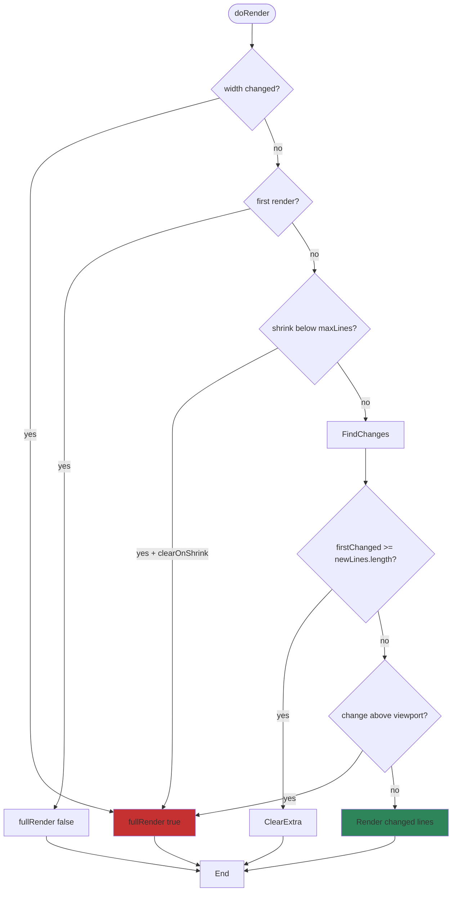
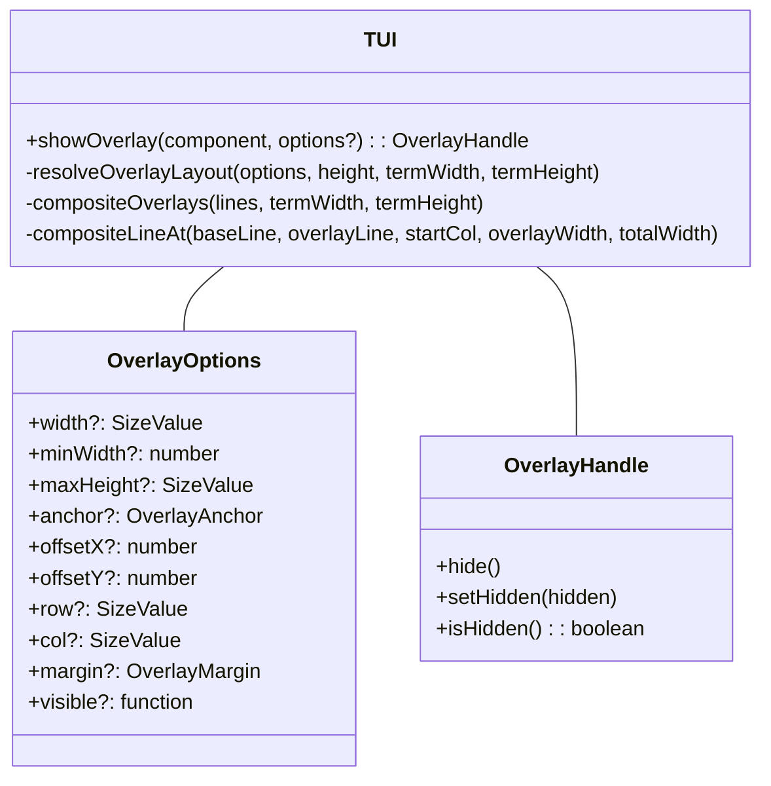
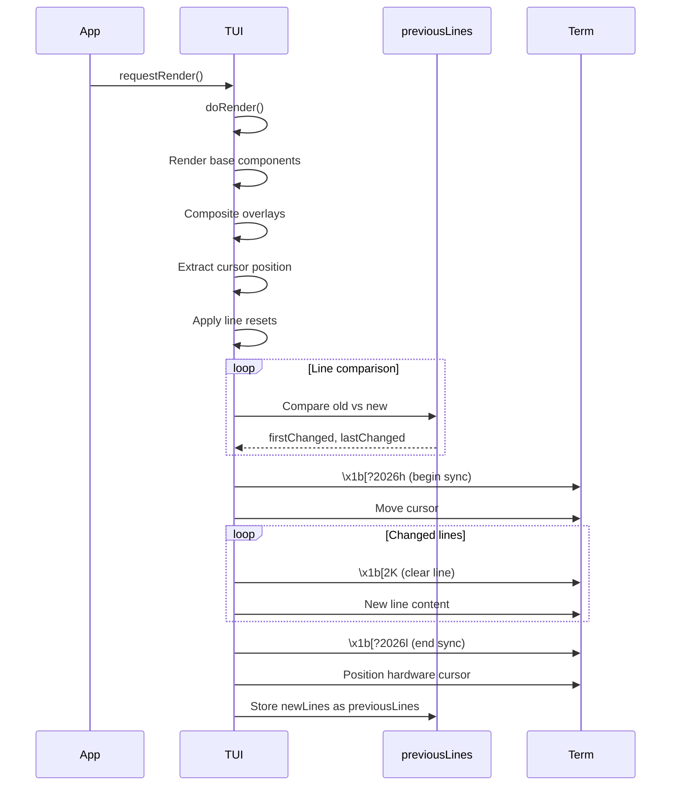

# tui.ts


Related: [[../../../00-start/home]] · [[../dashboard]] · [[../../coding-agent/guides/themes]] · [[../../coding-agent/guides/keybindings]] · [[terminal]] · [[../../../10-mirrors/tui/packages_tui_README]] · [[../../../10-mirrors/tui/api/packages_tui_src_tui]]

## Backlinks

- [[../../../10-mirrors/tui/api/packages_tui_src_tui]]
- [[../../../10-mirrors/coding-agent/docs/packages_coding-agent_docs_tui]]
- [[../../../00-start/graph-index]]
- [[../../../00-start/dashboards]]


> Auto-generated documentation for `packages/tui/src/tui.ts`

## Overview

Core TUI implementation with differential rendering and synchronized output. Manages a component tree, renders content to the terminal, handles keyboard input, and provides overlay support for modal components. Uses CSI 2026 for atomic screen updates to prevent flicker.

## Dependencies

| Import | Purpose |
|--------|---------|
| `node:fs`, `node:os`, `node:path` | Debug logging |
| `./keys.js` | `isKeyRelease`, `matchesKey` |
| `./terminal.js` | `Terminal` interface |
| `./terminal-image.js` | `getCapabilities`, `isImageLine`, `setCellDimensions` |
| `./utils.js` | `extractSegments`, `sliceByColumn`, `sliceWithWidth`, `visibleWidth` |

## API / Exports

### Component Interface

**`Component`** - Base interface for all TUI components

```typescript
interface Component {
  render(width: number): string[];
  handleInput?(data: string): void;
  wantsKeyRelease?: boolean;
  invalidate(): void;
}
```

**`Focusable`** - Interface for focusable components

```typescript
interface Focusable {
  focused: boolean;
}
```

**`isFocusable(component)`** - Type guard to check if component implements Focusable

### Cursor Marker

**`CURSOR_MARKER`** - APC sequence for hardware cursor positioning

```typescript
export const CURSOR_MARKER = "\x1b_pi:c\x07";
```

Components emit this in output when focused; TUI strips and positions hardware cursor for IME input.

### Container

**`Container`** - Basic component container

```typescript
class Container implements Component {
  children: Component[] = [];
  
  addChild(component: Component): void;
  removeChild(component: Component): void;
  clear(): void;
  render(width: number): string[];  // Concatenates child renders
  invalidate(): void;             // Recursively invalidates children
}
```

### Overlay System

**`OverlayAnchor`** - Positioning anchors:
```typescript
type OverlayAnchor = 
  | "center" | "top-left" | "top-right" | "bottom-left" | "bottom-right"
  | "top-center" | "bottom-center" | "left-center" | "right-center";
```

**`OverlayMargin`** - Edge margins:
```typescript
interface OverlayMargin {
  top?: number;
  right?: number;
  bottom?: number;
  left?: number;
}
```

**`SizeValue`** - Width/height can be absolute (number) or percentage (string):
```typescript
type SizeValue = number | `${number}%`;
```

**`OverlayOptions`** - Full overlay configuration:

```typescript
interface OverlayOptions {
  width?: SizeValue;        // Fixed width or percentage
  minWidth?: number;        // Minimum width
  maxHeight?: SizeValue;    // Maximum height
  
  anchor?: OverlayAnchor;   // Position anchor
  offsetX?: number;         // Horizontal offset
  offsetY?: number;         // Vertical offset
  
  row?: SizeValue;          // Absolute or percentage row
  col?: SizeValue;          // Absolute or percentage column
  
  margin?: OverlayMargin | number;  // Edge margins
  
  visible?: (termWidth, termHeight) => boolean;  // Responsive visibility
}
```

**`OverlayHandle`** - Returned by `showOverlay()`:

```typescript
interface OverlayHandle {
  hide(): void;              // Permanently remove
  setHidden(hidden: boolean): void;  // Toggle visibility
  isHidden(): boolean;
}
```

### TUI Class

**Constructor:** `new TUI(terminal: Terminal, showHardwareCursor?: boolean)`

**Lifecycle:**
- `start()` - Enable raw mode, hide cursor, query dimensions
- `stop()` - Restore terminal state
- `requestRender(force?)` - Schedule re-render (debounced)

**Component Management:**
- `addChild(component)` - Add to base component tree
- `removeChild(component)`
- `setFocus(component | null)` - Set focused component

**Overlays:**
- `showOverlay(component, options?)` - Show modal overlay, returns `OverlayHandle`
- `hideOverlay()` - Pop topmost overlay
- `hasOverlay()` - Check if any visible overlays exist

**Debug/State:**
- `fullRedraws` - Counter for debugging
- `getShowHardwareCursor()` / `setShowHardwareCursor()`
- `getClearOnShrink()` / `setClearOnShrink()` - Shrink behavior

**Event Handling:**
- `onDebug?: () => void` - Called on `Shift+Ctrl+D`
- `addInputListener(listener)` - Intercept input before components

### Differential Rendering

The TUI uses sophisticated differential rendering:

1. **First render:** Output all lines without clearing (assumes clean screen)
2. **Width change:** Full re-render + clear (line wrapping changes)
3. **Content shrink:** Optionally clear empty rows (controlled by `clearOnShrink`)
4. **Normal change:** Find first/last changed lines, update only those

**Line change detection:**
```typescript
// Find range of changed lines
if (oldLine !== newLine) {
  if (firstChanged === -1) firstChanged = i;
  lastChanged = i;
}

// Render only changed portion
for (let i = firstChanged; i <= lastChanged; i++) {
  buffer += "\x1b[2K" + newLines[i];  // Clear line + new content
}
```

**Synchronized output:**
- Begins with `\x1b[?2026h` (CSI 2026 set)
- Ends with `\x1b[?2026l` (CSI 2026 reset)
- Prevents tearing during multi-line updates

### Input Handling

**Process:**
1. `handleInput(data)` receives raw input
2. Input listeners can consume or transform data
3. Check cell size response (if pending)
4. Check debug key (`Shift+Ctrl+D`)
5. Verify focused overlay is still visible
6. Forward to `focusedComponent.handleInput()`
7. Filter key releases unless `wantsKeyRelease`

## Internal Details

### Rendering Strategies

The `doRender()` method implements multiple rendering strategies:

1. **First render:** Just output lines
2. **Width change:** `fullRender(true)` with clear
3. **Shrink below working area:** Optionally `fullRender(true)`
4. **Pure deletion** (firstChanged >= newLines.length): Clear extra lines
5. **Changes above viewport:** `fullRender(true)` - content scrolled off-screen
6. **Standard differential:** Move cursor, clear/update range

### Overlay Compositing

Overlays are composited into base content before differential comparison:

```typescript
let newLines = this.render(width);
newLines = this.compositeOverlays(newLines, width, height);
// Then proceed with differential
```

**Compositing process:**
1. Resolve overlay layout (width, height, position) using `OverlayOptions`
2. Render each visible overlay component
3. Sort by stack order
4. Calculate viewport start
5. `compositeLineAt()` - Splice overlay content into base lines
6. Apply resets: `applyLineResets()` (trailing `\x1b[0m\x1b]8;;\x07`)

### Width Overflow Protection

The TUI crashes intentionally if rendered content exceeds terminal width:

```typescript
if (visibleWidth(line) > width) {
  // Log crash data to ~/.pi/agent/pi-crash.log
  // Show helpful error message
  throw new Error("Rendered line exceeds terminal width...");
}
```

This catches component bugs early and prevents terminal corruption.

### Hardware Cursor Positioning

For IME input, the TUI:
1. Searches rendered lines for `CURSOR_MARKER`
2. Calculates visual column (width of text before marker)
3. Strips marker from output
4. Moves hardware cursor using `<ESC>[rowG`

## UML Diagrams

### Render Decision Tree



### Overlay Layout



### Differential Rendering Sequence

