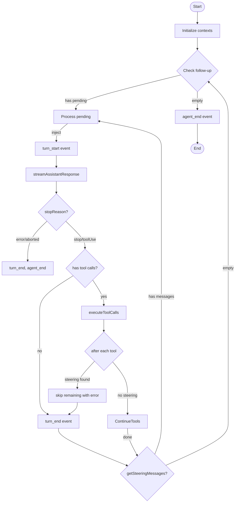
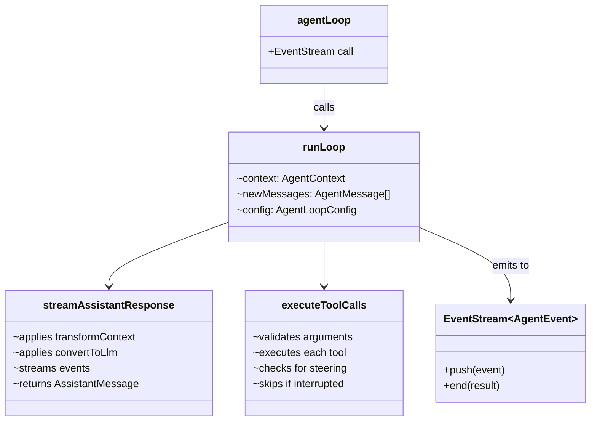

# agent-loop.ts


Related: [[../../../00-start/home]]


> Auto-generated documentation for `packages/agent/src/agent-loop.ts`

## Overview

Core agent loop implementation that manages LLM tool execution cycles. Provides `agentLoop()` for starting with new prompts and `agentLoopContinue()` for resuming from existing context. Handles message streaming, tool execution, steering message injection, and follow-up processing in a functional, event-driven style using `EventStream`.

## Dependencies

| Import | Purpose |
|--------|---------|
| `@mariozechner/pi-ai` | `AssistantMessage`, `Context`, `EventStream`, `streamSimple`, `ToolResultMessage`, `validateToolArguments` |
| `./types.js` | Agent types including `AgentContext`, `AgentContext`, `AgentEvent`, `AgentLoopConfig`, `AgentMessage`, `AgentTool`, `AgentToolResult` |

## API / Exports

### Main Functions

**`agentLoop(prompts, context, config, signal?, streamFn?)`** - Start new agent loop

```typescript
function agentLoop(
  prompts: AgentMessage[],
  context: AgentContext,
  config: AgentLoopConfig,
  signal?: AbortSignal,
  streamFn?: StreamFn
): EventStream<AgentEvent, AgentMessage[]>
```

Starts an agent loop with new prompt messages. Emits events for streaming and returns final messages on completion.

**`agentLoopContinue(context, config, signal?, streamFn?)`** - Continue existing context

```typescript
function agentLoopContinue(
  context: AgentContext,
  config: AgentLoopConfig,
  signal?: AbortSignal,
  streamFn?: StreamFn
): EventStream<AgentEvent, AgentMessage[]>
```

Continues from existing context without adding messages. Used for retries - context must end with user or toolResult message.

### Event Stream Creation

**`createAgentStream()`** - Factory for EventStream with agent completion conditions

```typescript
function createAgentStream(): EventStream<AgentEvent, AgentMessage[]>
```

- Completion event: `agent_end`
- Result: `event.messages` from `agent_end`

## Internal Details

### Run Loop Structure

```
runLoop(context, newMessages, config, signal, stream, streamFn):
  while true:                          // Outer: follow-up loop
    pendingMessages = getSteeringMessages() or []
    
    while hasMoreToolCalls || pendingMessages.length > 0:  // Inner: tool loop
      if pendingMessages: inject, start turn
      
      assistant = streamAssistantResponse()   // LLM call
      newMessages.push(assistant)
      
      if stop/error: turn_end, emit agent_end, return
      
      toolCalls = extract from content
      hasMoreToolCalls = toolCalls.length > 0
      
      if toolCalls: executeToolCalls(toolCalls)
      results -> newMessages
      
      emit turn_end
      
      // Check for steering after tools
      pendingMessages = getSteeringMessages() or []
    
    // No more tools, check follow-up
    followUpMessages = getFollowUpMessages()
    if followUpMessages.length == 0: break
    pendingMessages = followUpMessages

  emit agent_end(messages)
```

### Streaming Assistant Response

`streamAssistantResponse()`:

1. Apply `transformContext()` if configured (AgentMessage[] → AgentMessage[])
2. Apply `convertToLlm()` (AgentMessage[] → Message[])
3. Build `Context: { systemPrompt, messages, tools }`
4. Call `streamFn(config.model, llmContext, options)`
5. Stream events:
   - `start` → `message_start`
   - `text/thinking/toolcall` events → `message_update`
   - `done/error` → `message_end`, return final message

### Tool Execution

`executeToolCalls()`:

1. For each tool call:
   - Emit `tool_execution_start`
   - Validate arguments with `validateToolArguments()`
   - Call `tool.execute(id, params, signal, onUpdate)`
   - Stream partial results via `onUpdate` → `tool_execution_update`
   - Emit `tool_execution_end`
   - Push result to messages
   - **Steering check**: After each tool, poll `getSteeringMessages()`. If found, skip remaining tools with error result.

### Steering Behavior

When steering messages are detected after a tool:
1. Skip remaining pending tool calls with error status
2. Add steering messages to `pendingMessages`
3. Inner loop continues, processing steering before next LLM call

## UML Diagrams

### Loop Flowchart



### Message Transformation

```mermaid
sequenceDiagram
    participant Loop as agentLoop
    participant Transform
    participant Convert
    participant LLM
    
    Loop->>Transform: messages
    Note over Transform: transformContext
    Transform->>Transform: prune/inject
    Transform-->>Convert: AgentMessage[]
    
    Note over Convert: convertToLlm
    Convert->>Convert: filter custom types
    Convert-->>LLM: Message[]
```

### Tool Execution Sequence

```mermaid
sequenceDiagram
    participant Loop
    participant Tool1 as Tool 1
    participant Steering
    participant Tool2 as Tool 2 (skipped)
    participant ToolN as Tool N (skipped)
    
    Loop->>Tool1: execute
    Tool1-->>Loop: result
    Loop->>Steering: getSteeringMessages()
    
    alt Has steering
        Steering-->>Loop: messages
        Loop->>Tool2: skip with error
        Loop->>ToolN: skip with error
    else No steering
        Steering-->>Loop: []
        Loop->>Tool2: execute
    end
```

### Class Relationships

