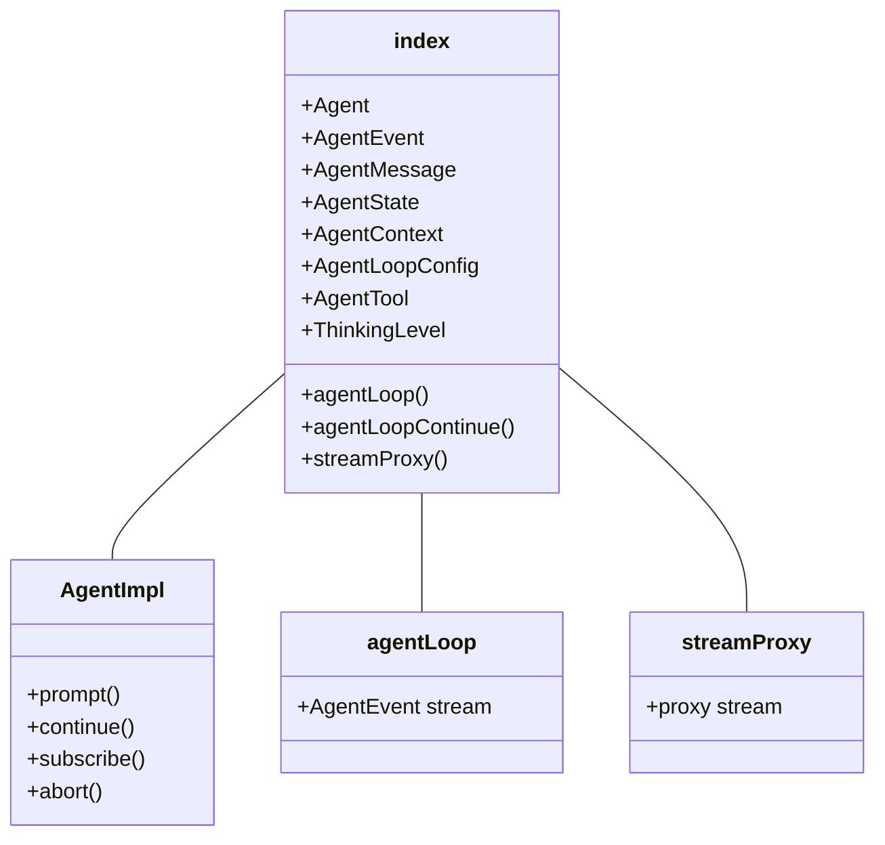
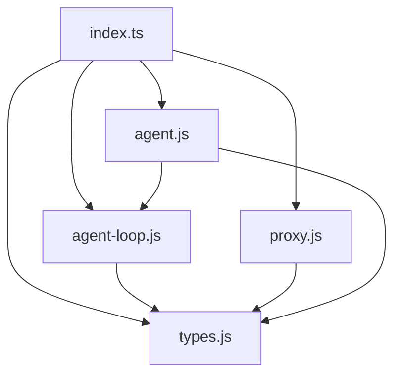

# index.ts


Related: [[../../../00-start/home]]


> Auto-generated documentation for `packages/agent/src/index.ts`

## Overview

Main entry point for the `@mariozechner/pi-agent-core` package. Exports the Agent class, agent loop functions, proxy utilities, and all type definitions. This is a barrel file that re-exports from submodules.

## Dependencies

| Import | Purpose |
|--------|---------|
| `./agent.js` | `Agent` class |
| `./agent-loop.js` | `agentLoop` and `agentLoopContinue` functions |
| `./proxy.js` | `streamProxy` for proxy backends |
| `./types.js` | All type definitions |

## API / Exports

### Core Exports

**`Agent`** - Main agent class

```typescript
import { Agent } from "@mariozechner/pi-agent-core";

const agent = new Agent({
  initialState: {
    systemPrompt: "You are a helpful assistant.",
    model: getModel("anthropic", "claude-sonnet-4"),
  }
});
```

### Loop Functions

**`agentLoop`** - Start an agent loop with new prompt

```typescript
function agentLoop(
  prompts: AgentMessage[],
  context: AgentContext,
  config: AgentLoopConfig,
  signal?: AbortSignal,
  streamFn?: StreamFn
): EventStream<AgentEvent, AgentMessage[]>
```

**`agentLoopContinue`** - Continue from existing context

```typescript
function agentLoopContinue(
  context: AgentContext,
  config: AgentLoopConfig,
  signal?: AbortSignal,
  streamFn?: StreamFn
): EventStream<AgentEvent, AgentMessage[]>
```

### Proxy Support

**`streamProxy`** - Proxy stream function for custom backends

```typescript
import { Agent, streamProxy } from "@mariozechner/pi-agent-core";

const agent = new Agent({
  streamFn: (model, context, options) => 
    streamProxy(model, context, { ...options, authToken: "...", proxyUrl: "..." })
});
```

### Type Exports

Re-exports all types from `./types.js`:
- `AgentEvent`, `AgentMessage`, `AgentState`
- `AgentContext`, `AgentLoopConfig`
- `AgentTool`, `AgentToolResult`, `AgentToolUpdateCallback`
- `CustomAgentMessages`, `ThinkingLevel`
- `StreamFn`

## UML Diagrams

### Module Structure



### Export Dependency Graph

