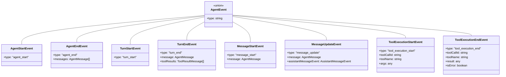
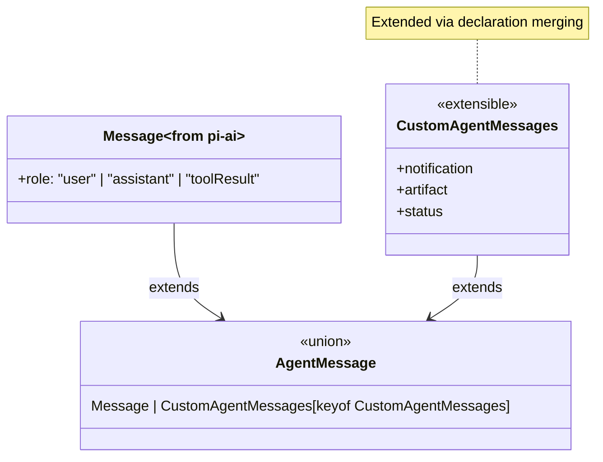

# types.ts


Related: [[../../../00-start/home]]


> Auto-generated documentation for `packages/agent/src/types.ts`

## Overview

Core type definitions for the `@mariozechner/pi-agent-core` package. Defines the AgentMessage abstraction (LLM messages + custom app types), AgentState, AgentTool with execution, configuration for the agent loop, and the comprehensive AgentEvent system for streaming.

## Dependencies

| Import | Purpose |
|--------|---------|
| `@mariozechner/pi-ai` | Base `Message` types, `AssistantMessageEvent`, `Model`, `Tool`, `ToolResultMessage` |
| `@sinclair/typebox` | `Static`, `TSchema` for typed tool parameters |

## API / Exports

### Stream Function

**`StreamFn`** - Agent-compatible stream function type

```typescript
type StreamFn = (
  ...args: Parameters<typeof streamSimple>
) => ReturnType<typeof streamSimple> | Promise<...ReturnType>;
```

Allows sync return or Promise for async config lookup.

### Agent Loop Configuration

**`AgentLoopConfig`** - Configuration for `agentLoop()`/`agentLoopContinue()`

```typescript
interface AgentLoopConfig extends SimpleStreamOptions {
  model: Model<any>;
  convertToLlm: (messages: AgentMessage[]) => Message[] | Promise<Message[]>;
  transformContext?: (messages: AgentMessage[], signal?: AbortSignal) => Promise<AgentMessage[]>;
  getApiKey?: (provider: string) => Promise<string | undefined> | string | undefined;
  getSteeringMessages?: () => Promise<AgentMessage[]>;
  getFollowUpMessages?: () => Promise<AgentMessage[]>;
}
```

**`convertToLlm`** - Transform AgentMessage[] → Message[] before LLM calls (required)
- Filters out UI-only messages (notifications, custom types)
- Converts attachments to LLM-compatible format
- Example: filter to only user/assistant/toolResult roles

**`transformContext`** - Optional context pruning/injection
- Called before `convertToLlm`
- Use for context window management, external context injection
- Can prune old messages or add context

**`getSteeringMessages`** - Called after each tool execution to check for interruptions
- If returns messages, remaining tools are skipped
- Used for "steering" the agent mid-run

**`getFollowUpMessages`** - Called when agent would otherwise stop
- If returns messages, another turn starts with them
- Used for follow-up after current work finishes

### Extended Messages

**`CustomAgentMessages`** - Extension point for custom message types

```typescript
interface CustomAgentMessages {
  // Empty by default - apps extend via declaration merging
}
```

**Example extension:**
```typescript
declare module "@mariozechner/pi-agent-core" {
  interface CustomAgentMessages {
    notification: { role: "notification"; text: string; timestamp: number };
    artifact: { role: "artifact"; content: string; metadata: unknown };
  }
}
```

**`AgentMessage`** - Union of LLM messages + custom types

```typescript
type AgentMessage = Message | CustomAgentMessages[keyof CustomAgentMessages];
```

Enables applications to add custom message types while maintaining compatibility with LLM calls.

### Thinking Levels

**`ThinkingLevel`** - Reasoning effort levels

```typescript
type ThinkingLevel = "off" | "minimal" | "low" | "medium" | "high" | "xhigh";
```

Note: `xhigh` only supported by specific models (GPT-5.2/5.3, Claude Opus 4.5/4.6).

### Agent State

**`AgentState`** - Complete agent state

```typescript
interface AgentState {
  systemPrompt: string;
  model: Model<any>;
  thinkingLevel: ThinkingLevel;
  tools: AgentTool<any>[];
  messages: AgentMessage[];  // Can include custom types
  isStreaming: boolean;
  streamMessage: AgentMessage | null;  // Current partial
  pendingToolCalls: Set<string>;       // Track active tool calls
  error?: string;
}
```

### Tools

**`AgentToolResult<T>`** - Tool execution result

```typescript
interface AgentToolResult<T> {
  content: (TextContent | ImageContent)[];  // Text and image output
  details: T;                                // UI/log display data
}
```

**`AgentToolUpdateCallback<T>`** - Streaming tool results

```typescript
type AgentToolUpdateCallback<T> = (partialResult: AgentToolResult<T>) => void;
```

**`AgentTool<TParameters, TDetails>`** - Executable tool definition

```typescript
interface AgentTool<TParams extends TSchema, TDetails> extends Tool<TParams> {
  label: string;  // Human-readable label for UI
  execute: (
    toolCallId: string,
    params: Static<TParams>,
    signal?: AbortSignal,
    onUpdate?: AgentToolUpdateCallback<TDetails>
  ) => Promise<AgentToolResult<TDetails>>;
}
```

Tools extend base `Tool` with:
- `label` - Display name
- `execute()` function with tool call ID, validated params, abort signal, and update callback

**Example:**
```typescript
const readFileTool: AgentTool = {
  name: "read_file",
  label: "Read File",
  description: "Read file contents",
  parameters: Type.Object({ path: Type.String() }),
  execute: async (callId, params, signal, onUpdate) => {
    const content = await fs.readFile(params.path);
    return {
      content: [{ type: "text", text: content }],
      details: { path: params.path, size: content.length }
    };
  }
};
```

### Agent Context

**`AgentContext`** - Conversation context for agent loop

```typescript
interface AgentContext {
  systemPrompt: string;
  messages: AgentMessage[];
  tools?: AgentTool<any>[];
}
```

Similar to LLM `Context` but uses `AgentTool` and `AgentMessage`.

### Agent Events

**`AgentEvent`** - Discriminated union of all events

#### Lifecycle Events
```typescript
{ type: "agent_start" }
{ type: "agent_end"; messages: AgentMessage[] }
{ type: "turn_start" }
{ type: "turn_end"; message: AgentMessage; toolResults: ToolResultMessage[] }
```

#### Message Events
```typescript
{ type: "message_start"; message: AgentMessage }
{ type: "message_update"; message: AgentMessage; assistantMessageEvent: AssistantMessageEvent }
{ type: "message_end"; message: AgentMessage }
```

#### Tool Execution Events
```typescript
{ type: "tool_execution_start"; toolCallId: string; toolName: string; args: any }
{ type: "tool_execution_update"; toolCallId: string; toolName: string; args: any; partialResult: any }
{ type: "tool_execution_end"; toolCallId: string; toolName: string; result: any; isError: boolean }
```

**Event Flow:**
```
agent_start → turn_start → message_start (user) → message_end (user)
  → message_start (assistant) → [message_update... with AssistantMessageEvent]
  → message_end (assistant) → tool_execution_start → tool_execution_update/end
  → turn_end → [repeat or] → agent_end
```

## Internal Details

### Type Safety Patterns

**Declaration Merging for Custom Messages:**
```typescript
// Module augmentation pattern
interface CustomAgentMessages { /* empty */ }
type AgentMessage = Message | CustomAgentMessages[keyof CustomAgentMessages];
```

Apps extend via:
```typescript
declare module "@mariozechner/pi-agent-core" {
  interface CustomAgentMessages { customType: CustomMessageType }
}
```

**Tool Type Safety:**
- `TParameters extends TSchema` - TypeBox validation schema
- `Static<TParameters>` - Extracts TypeScript type from schema
- `TDetails` - Arbitrary type for tool-specific result details

### Message Flow Architecture

```
AgentMessage[] → transformContext → AgentMessage[]
             → convertToLlm → Message[] → LLM call
```

This two-stage transformation:
1. `transformContext` - Works at AgentMessage level (pruning, injection)
2. `convertToLlm` - Final filter to LLM-compatible Message[]

## UML Diagrams

### Event Type Hierarchy



### Tool Execution Flow

```mermaid
sequenceDiagram
    participant Loop as agentLoop
    participant Agent as Agent.execute
    participant Tool as AgentTool
    participant Callback as onUpdate callback
    
    Loop->>Loop: Find tool from toolCalls
    Loop->>Loop: emit tool_execution_start
    
    Loop->>Agent: tool.execute(id, params, signal, onUpdate)
    
    Agent-)Callback: onUpdate(partialResult) [optional]
    Callback->>Loop: emit tool_execution_update
    
    Agent-->>Loop: return AgentToolResult
    
    Loop->>Loop: emit tool_execution_end
    Loop->>Loop: push toolResult to messages
```

### AgentMessage Extension

