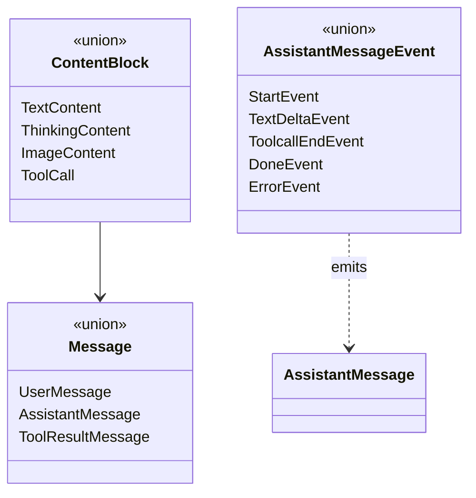
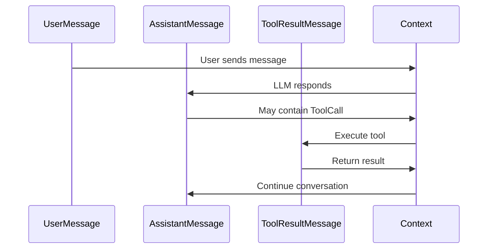
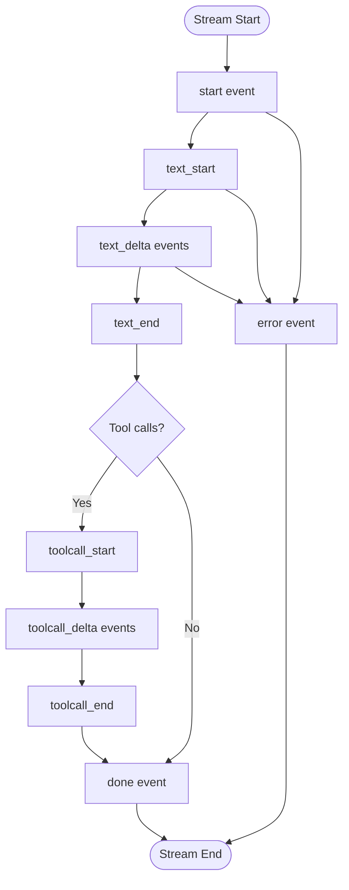

# types.ts


Related: [[../../../00-start/home]]


> Auto-generated documentation for `packages/ai/src/types.ts`

## Overview

Core type definitions for the `@mariozechner/pi-ai` package. Defines TypeScript interfaces and types for models, messages, content blocks, tools, and streaming events. These types provide the foundation for type-safe LLM interactions across all supported providers.

## Dependencies

| Import | Purpose |
|--------|---------|
| `@sinclair/typebox` | `TSchema` type for tool parameter schemas |
| `./utils/event-stream.js` | `AssistantMessageEventStream` re-export |

## API / Exports

### API Identifiers

**`KnownApi`** - Union of all supported API identifiers:
```typescript
"openai-completions" | "openai-responses" | "azure-openai-responses" | 
"openai-codex-responses" | "anthropic-messages" | "bedrock-converse-stream" | 
"google-generative-ai" | "google-gemini-cli" | "google-vertex"
```

**`Api`** - `KnownApi | (string & {})` - Allows autocomplete with custom values

**`KnownProvider`** - Union of all known provider names including:
- `amazon-bedrock`, `anthropic`, `google`, `openai`, `xai`, `groq`, `cerebras`, `openrouter`
- Plus OAuth providers: `github-copilot`, `google-gemini-cli`, `google-antigravity`, etc.

**`Provider`** - `KnownProvider | string` - Allows custom providers

### Configuration Types

**`ThinkingLevel`** - `"minimal" | "low" | "medium" | "high" | "xhigh"`

**`ThinkingBudgets`** - Token budgets per thinking level:
```typescript
{
  minimal?: number;
  low?: number;
  medium?: number;
  high?: number;
}
```

**`StreamOptions`** - Base options for all streaming calls:
- `temperature?: number` - Sampling temperature
- `maxTokens?: number` - Max output tokens
- `signal?: AbortSignal` - Cancellation signal
- `apiKey?: string` - API key override
- `transport?: "sse" | "websocket" | "auto"` - Transport preference
- `cacheRetention?: "none" | "short" | "long"` - Prompt cache retention
- `sessionId?: string` - Session identifier for provider caching
- `onPayload?: (payload) => void` - Debug payload inspector
- `headers?: Record<string, string>` - Custom headers
- `maxRetryDelayMs?: number` - Max retry wait time
- `metadata?: Record<string, unknown>` - Provider-specific metadata

**`SimpleStreamOptions`** - Extends `StreamOptions` with:
- `reasoning?: ThinkingLevel` - Unified thinking level
- `thinkingBudgets?: ThinkingBudgets` - Custom token budgets

### Content Blocks

**`TextContent`** - Text message segment:
```typescript
{ type: "text"; text: string; textSignature?: string }
```

**`ThinkingContent`** - Model reasoning/thinking:
```typescript
{ 
  type: "thinking"; 
  thinking: string; 
  thinkingSignature?: string;
  redacted?: boolean 
}
```

**`ImageContent`** - Image input:
```typescript
{ type: "image"; data: string; mimeType: string }
```
- `data` - Base64 encoded image data
- `mimeType` - e.g., "image/jpeg", "image/png"

**`ToolCall`** - LLM tool invocation:
```typescript
{ 
  type: "toolCall"; 
  id: string; 
  name: string; 
  arguments: Record<string, any>;
  thoughtSignature?: string 
}
```

### Messages

**`UserMessage`** - User input:
```typescript
{
  role: "user";
  content: string | (TextContent | ImageContent)[];
  timestamp: number;
}
```

**`AssistantMessage`** - LLM response:
```typescript
{
  role: "assistant";
  content: (TextContent | ThinkingContent | ToolCall)[];
  api: Api;
  provider: Provider;
  model: string;
  usage: Usage;
  stopReason: StopReason;
  errorMessage?: string;
  timestamp: number;
}
```

**`ToolResultMessage`** - Tool execution result:
```typescript
{
  role: "toolResult";
  toolCallId: string;
  toolName: string;
  content: (TextContent | ImageContent)[];
  details?: TDetails;
  isError: boolean;
  timestamp: number;
}
```

**`Message`** - Union of all message types

### Tool Definition

**`Tool<TParameters>`** - Tool schema for LLM:
```typescript
{
  name: string;
  description: string;
  parameters: TSchema;
}
```

### Context

**`Context`** - Conversation context:
```typescript
{
  systemPrompt?: string;
  messages: Message[];
  tools?: Tool[];
}
```

### Usage & Costs

**`Usage`** - Token counts and costs:
```typescript
{
  input: number;
  output: number;
  cacheRead: number;
  cacheWrite: number;
  totalTokens: number;
  cost: {
    input: number; output: number; cacheRead: number; cacheWrite: number; total: number;
  };
}
```

**`StopReason`** - `"stop" | "length" | "toolUse" | "error" | "aborted"`

### Streaming Events

**`AssistantMessageEvent`** - Discriminated union of all event types:
- `start` - Stream begins with partial message template
- `text_start/text_delta/text_end` - Text content streaming
- `thinking_start/thinking_delta/thinking_end` - Thinking content streaming
- `toolcall_start/toolcall_delta/toolcall_end` - Tool call streaming
- `done` - Stream complete with final message
- `error` - Error occurred

### Model Definition

**`Model<TApi>`** - Complete model specification:
```typescript
interface Model<TApi extends Api> {
  id: string;
  name: string;
  api: TApi;
  provider: Provider;
  baseUrl: string;
  reasoning: boolean;
  input: ("text" | "image")[];
  cost: { input: number; output: number; cacheRead: number; cacheWrite: number };
  contextWindow: number;
  maxTokens: number;
  headers?: Record<string, string>;
  compat?: OpenAICompletionsCompat | OpenAIResponsesCompat;
}
```

### Compatibility Settings

**`OpenAICompletionsCompat`** - Fine-grained compatibility flags:
- `supportsStore?`, `supportsDeveloperRole?`, `supportsReasoningEffort?`
- `maxTokensField?` - Field name for max tokens
- `requiresToolResultName?`, `requiresAssistantAfterToolResult?`
- `requiresThinkingAsText?` - Convert thinking to `<thinking>` tags
- `requiresMistralToolIds?` - Normalize tool call IDs
- `thinkingFormat?` - "openai" | "zai" | "qwen"
- `openRouterRouting?`, `vercelGatewayRouting?`
- `supportsStrictMode?`

## Internal Details

The type system uses several advanced TypeScript patterns:

1. **Template literal types** - For API/provider identification
2. **Conditional types** - `Model<TApi>` constrains `compat` based on `api`
3. **Discriminated unions** - `AssistantMessageEvent` uses `type` field for narrowing
4. **Open extension** - `Api` and `Provider` allow custom strings while maintaining autocomplete

The `SimpleStreamOptions` interface enables cross-provider reasoning through the unified `reasoning` option, mapped to provider-specific parameters internally.

## UML Diagrams

### Type Hierarchy



### Message Flow Types



### Event Stream Types

