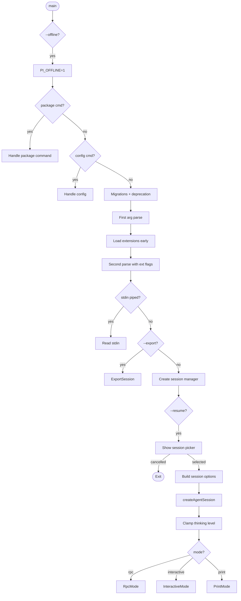
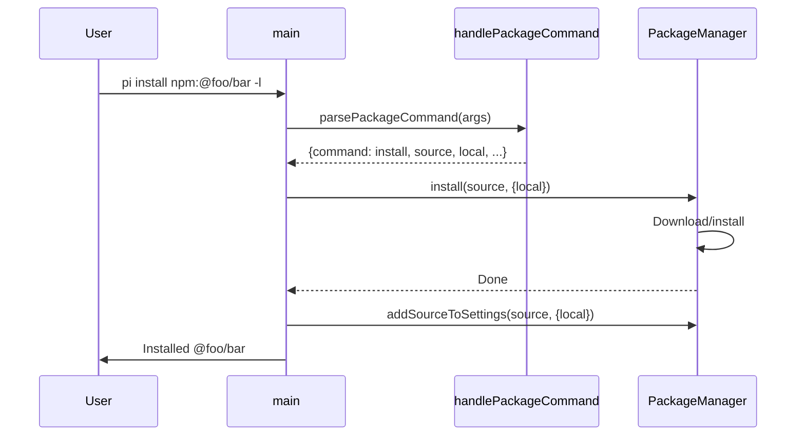
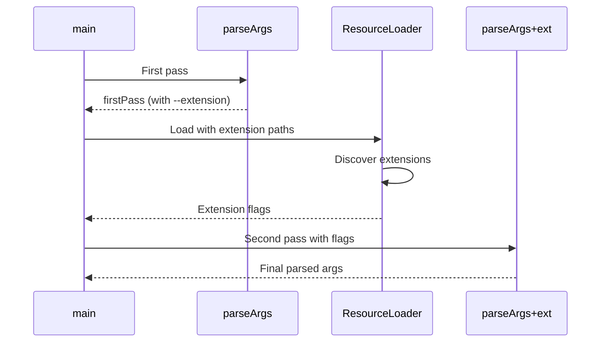

# main.ts


Related: [[../../../00-start/home]]


> Auto-generated documentation for `packages/coding-agent/src/main.ts`

## Overview

Main entry point for the pi coding agent CLI. Handles argument parsing, command dispatch (package commands, config), session management, model resolution, and mode execution (interactive, print, RPC, export). Bridges CLI flags to `createAgentSession()` SDK calls.

## Dependencies

| Import | Purpose |
|--------|---------|
| `@mariozechner/pi-ai` | `ImageContent`, `modelsAreEqual`, `supportsXhigh` |
| `chalk` | Terminal colors |
| `readline` | Interactive prompts |
| `./cli/*.js` | CLI parsing and UI helpers |
| `./core/*.js` | Core modules (SDK, settings, extensions, etc.) |
| `./modes/*.js` | Mode implementations (interactive, print, RPC) |
| `./config.js` | Paths, constants |
| `./migrations.js` | Settings migrations |

## API / Exports

### Main Export

**`main(args: string[])`** - CLI entry point

```typescript
export async function main(args: string[]): Promise<void>
```

Called by `pi` binary. Handles all CLI modes and commands.

### Internal Functions

**`handlePackageCommand(args)`** - Package install/remove/update/list

Supported commands:
- `install <source> [-l]` - Install from npm, git, or local path
- `remove <source> [-l]` - Remove installed package
- `update [source]` - Update packages
- `list` - Show installed packages

**`handleConfigCommand(args)`** - Interactive config selector

Opens TUI for managing package resources (extensions, skills, themes).

**`createSessionManager(parsed)`** - Create SessionManager from CLI flags

Handles `--no-session`, `--session`, `--continue`, `--resume`, `--session-dir`.

**`buildSessionOptions(parsed, scopedModels, ...)`** - Build SDK options

Maps CLI flags to `CreateAgentSessionOptions`:
- `--provider/--model` → `options.model`
- `--thinking` → `options.thinkingLevel`
- `--tools/--no-tools` → `options.tools` 
- `--extension/--skill/--prompt-template/--theme` → Resource loading

**`prepareInitialMessage(parsed)`** - Process `@file` arguments

Returns `{ initialMessage?, initialImages? }` for first prompt.

**`resolveSessionPath(arg, cwd, sessionDir?)`** - Resolve session ID to path

Returns `ResolvedSession` with type: `"path" | "local" | "global" | "not_found"`.

## Internal Details

### Execution Flow

```
main(args):
  1. Check offline mode (--offline)
  2. Handle package commands
  3. Handle config command
  4. Run migrations
  5. Parse CLI args (first pass for extensions)
  6. Load extensions early
  7. Parse CLI args (second pass with extension flags)
  8. Handle --version/--help/--list-models
  9. Read piped stdin (if not RPC mode)
  10. Handle --export
  11. Prepare session manager
  12. Handle --resume (shows session picker)
  13. Build session options
  14. Create agent session
  15. Clamp thinking level to model capabilities
  16. Execute mode:
      - RPC → runRpcMode()
      - Interactive → InteractiveMode.run()
      - Print → runPrintMode()
```

### Package Command Parsing

`parsePackageCommand()` returns `PackageCommandOptions`:
- `command`: install | remove | update | list
- `source`: Package source/target
- `local`: Project-local install
- `help`: Show help
- `invalidOption`: Unknown flag

### Extension Integration

Two-pass argument parsing:
1. **First pass:** Parse to get `--extension` paths
2. **Load extensions:** Early load with paths
3. **Extract extension flags:** Collect from loaded extensions
4. **Second pass:** Parse with extension flags included

Extension flags are then passed to `extensionsResult.runtime.flagValues`.

### Model Resolution

`buildSessionOptions()` handles complex model resolution:

```typescript
// CLI --model with thinking shorthand: "gpt-4o:high"
const { model, thinkingLevel } = resolveCliModel({
  cliProvider: parsed.provider,
  cliModel: parsed.model
});

// --models flag for scoped cycling
if (scopedModels.length > 0) {
  // Use first scoped model if no explicit model
  options.model = scopedModels[0].model;
  options.thinkingLevel = scopedModels[0].thinkingLevel;
}
```

### Session Resolution

```typescript
// --session resolves to path or session ID prefix
resolveSessionPath("abc123", cwd):
  1. If looks like path (contains "/"), use as-is
  2. Search local sessions for ID prefix
  3. Search global sessions for ID prefix
  4. Prompt to fork if found in different project
  5. Error if not found
```

### Mode Execution

**RPC mode:** Direct JSON-RPC over stdin/stdout

**Interactive mode:** Full TUI with:
- Theme initialization
- Scoped models display
- InteractiveMode class

**Print mode:**
- Single message → print response
- Multiple messages → process sequentially

## UML Diagrams

### CLI Flow



### Package Command Flow



### Argument Parsing Sequence

