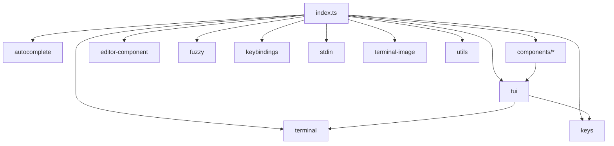
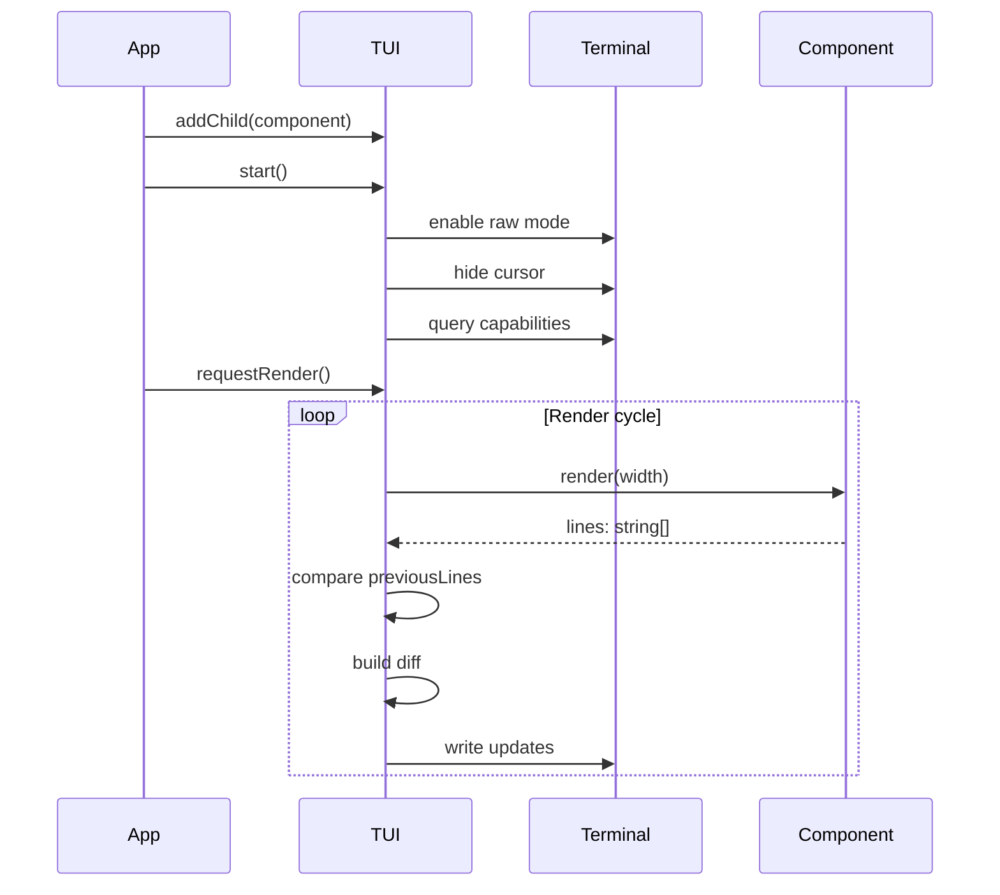

# index.ts


Related: [[../../../00-start/home]]


> Auto-generated documentation for `packages/tui/src/index.ts`

## Overview

Main entry point for the `@mariozechner/pi-tui` package. Exports the core TUI framework including the TUI class, various UI components, keybindings, terminal abstractions, and image rendering support. This is a barrel file that re-exports from submodules.

## Dependencies

| Import | Purpose |
|--------|---------|
| `./autocomplete.js` | Autocomplete providers and slash commands |
| `./components/*.js` | UI components (Editor, Input, Markdown, SelectList, etc.) |
| `./editor-component.js` | `EditorComponent` interface |
| `./fuzzy.js` | Fuzzy matching utilities |
| `./keybindings.js` | Keybinding management |
| `./keys.js` | Key parsing and matching |
| `./stdin-buffer.js` | Input buffering for batch splitting |
| `./terminal.js` | `Terminal` interface and `ProcessTerminal` |
| `./terminal-image.js` | Kitty/iTerm2 image rendering |
| `./tui.js` | Core `TUI` class, `Container`, `Component` |
| `./utils.js` | Text width/truncation utilities |

## API / Exports

### Core Classes

**`TUI`** - Main terminal UI manager

```typescript
const tui = new TUI(terminal);  // or new TUI(terminal, showHardwareCursor)

// Component management
tui.addChild(component);
tui.removeChild(component);
tui.setFocus(component);

// Overlay system
tui.showOverlay(component, options);
tui.hideOverlay();

// Lifecycle
tui.start();
tui.stop();
tui.requestRender(force?);

// State
tui.fullRedraws;  // Number of full re-renders performed
```

**`Container`** - Component container implementation

**`ProcessTerminal`** - Real terminal implementation using `process.stdin/stdout`

```typescript
const term = new ProcessTerminal();
// Use PI_TUI_WRITE_LOG env for debugging writes
```

### Components

**`Box`** - Bordered box container

**`CancellableLoader`** - Loading indicator with cancel support

**`Editor`** - Multi-line text editor with Emacs keybindings

```typescript
const editor = new Editor(tui, theme);
editor.onSubmit = (text) => console.log(text);
editor.placeholder = "Type here...";
```

**`Image`** - Inline terminal image rendering

**`Input`** - Single-line text input with autocomplete

**`Loader`** - Simple loading indicator

**`Markdown`** - Markdown rendering component

**`SelectList`** - Selection list with keyboard navigation

**`SettingsList`** - Settings with labels and values

**`Spacer`** - Flexible space component

**`Text`** - Basic text component

**`TruncatedText`** - Text with truncation

### Keybindings

**`KeybindingsManager`** - Global keybinding handler

**`matchesKey(data, keyId)`** - Check if input matches a key

**KeyId format:**
- `ctrl+c`, `alt+enter`, `shift+tab`
- `escape`, `backspace`, `delete`
- Arrow keys: `up`, `down`, `left`, `right`

### Keyboard Handling

**`parseKey(data)`** - Parse terminal input string

**Key states:**
- `isKeyRelease(key)` - Check if key is a release event
- `isKeyRepeat(key)` - Check if key is auto-repeat
- `isKittyProtocolActive()` - Check Kitty protocol support

**Kitty Protocol:**
- `setKittyProtocolActive(active)` - Set global state
- Enhanced key reporting (press/release/repeat)

### Terminal Image Support

**`renderImage(data, mimeType, options?)`** - Render inline image

**Image protocols:**
- Kitty Graphics Protocol (preferred)
- iTerm2 Inline Images Protocol
- Fallback: show filename

**Capabilities detection:**
```typescript
detectCapabilities();      // Probe terminal
getCapabilities();           // Get current capability set
getCellDimensions();       // Pixel dimensions per cell
```

**Image utilities:**
- `encodeKitty()` / `encodeITerm2()` - Format for protocol
- `getPngDimensions()` / `getJpegDimensions()` / etc. - Parse image metadata
- `allocateImageId()` / `deleteKittyImage()` - Manage Kitty image IDs

### Input Buffering

**`StdinBuffer`** - Split batched input into individual sequences

```typescript
const buffer = new StdinBuffer(options);
buffer.on("data", (sequence) => ...);      // Individual key
buffer.on("paste", (content) => ...);      // Pasted content
buffer.process(data);                       // Feed raw input
```

### Autocomplete

**`fuzzyMatch(text, pattern)`** - Fuzzy string matching

**`fuzzyFilter(items, pattern, key?)`** - Filter array with fuzzy search

**`SlashCommand`** - Autocomplete command definition

**`CombinedAutocompleteProvider`** - Merge multiple providers

### Utilities

**`visibleWidth(text)`** - Calculate visible character width (ignores ANSI)

**`truncateToWidth(text, width)`** - Truncate to visible width

**`wrapTextWithAnsi(text, width)`** - Wrap with ANSI preservation

**`CURSOR_MARKER`** - APC sequence for hardware cursor positioning

**`isFocusable(component)`** - Type guard for Focusable

## UML Diagrams

### Module Dependency Graph



### Component Hierarchy

```mermaid
classDiagram
    class Component {
        <<interface>>
        +render(width) string[]
        +handleInput(data)?
    }
    
    class Focusable {
        <<interface>>
        +focused: boolean
    }
    
    class Container {
        +children: Component[]
        +addChild(c)
        +removeChild(c)
    }
    
    class TUI {
        +terminal: Terminal
        +setFocus(component)
        +showOverlay(component, options)
        +start()
        +stop()
    }
    
    class Editor {
        +onSubmit: (text) => void
        +placeholder: string
    }
    
    class SelectList {
        +onSelect: (item) => void
        +items: SelectItem[]
    }
    
    Component -- Focusable
    Container --| Component
    TUI --| Container
    Component -- Editor
    Component -- SelectList
```

### TUI Rendering Flow

