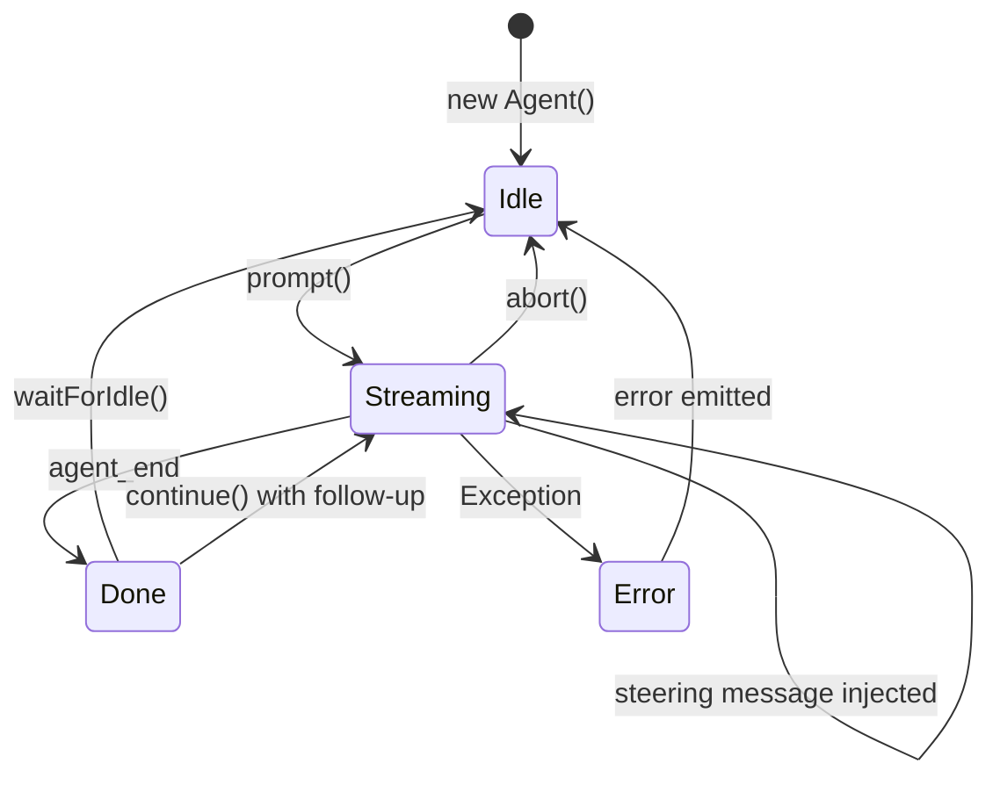

# agent.ts

> Auto-generated documentation for `packages/agent/src/agent.ts`

## Overview

Core Agent class that provides high-level orchestration over the agent-loop. Manages state, handles steering/follow-up queues, manages tool execution, and provides event-based streaming for UI integration. Bridges the low-level `agentLoop` with application-level concerns like model management, tool registry, and message queuing.

## Dependencies

| Import | Purpose |
|--------|---------|
| `@mariozechner/pi-ai` | Model types, streaming functions, `supportsXhigh`, `ImageContent` |
| `./agent-loop.js` | `agentLoop`, `agentLoopContinue` |
| `./types.js` | All agent-related types |

## API / Exports

### AgentOptions

Configuration options for the Agent constructor:

```typescript
interface AgentOptions {
  initialState?: Partial<AgentState>;
  convertToLlm?: (messages: AgentMessage[]) => Message[] | Promise<Message[]>;
  transformContext?: (messages: AgentMessage[], signal?: AbortSignal) => Promise<AgentMessage[]>;
  steeringMode?: "all" | "one-at-a-time";
  followUpMode?: "all" | "one-at-a-time";
  streamFn?: StreamFn;
  sessionId?: string;
  getApiKey?: (provider: string) => Promise<string | undefined> | string | undefined;
  thinkingBudgets?: ThinkingBudgets;
  transport?: Transport;
  maxRetryDelayMs?: number;
}
```

**Key options:**
- `convertToLlm` - Transform AgentMessage[] → Message[] before LLM calls (default: filter to user/assistant/toolResult)
- `transformContext` - Optional context pruning/injection (called before convertToLlm)
- `streamFn` - Custom stream function (default: `streamSimple`)
- `getApiKey` - Dynamic API key resolution (for expiring OAuth tokens)

### Agent Class

**Constructor:** `new Agent(opts?: AgentOptions)`

**State Access:**
- `agent.state` - Current `AgentState`
- `agent.sessionId` - Session ID for caching
- `agent.thinkingBudgets` - Current thinking budgets
- `agent.transport` - Current transport preference

**Session Management:**
- `set sessionId(value)` - Update session ID
- `set thinkingBudgets(value)` - Update budgets
- `setTransport(value)` - Update transport
- `set maxRetryDelayMs(value)` - Update retry cap

**State Mutators:**
- `setSystemPrompt(v)` - Set system prompt
- `setModel(m)` - Set model
- `setThinkingLevel(l)` - Set thinking level
- `setTools(t)` - Set active tools
- `replaceMessages(ms)` - Replace message history
- `appendMessage(m)` - Append single message
- `clearMessages()` - Clear all messages
- `reset()` - Reset to initial state

**Message Queues:**
- `steer(m)` - Queue steering message (interrupts tools)
- `followUp(m)` - Queue follow-up message (waits until done)
- `clearSteeringQueue()` - Clear steering queue
- `clearFollowUpQueue()` - Clear follow-up queue
- `clearAllQueues()` - Clear both queues
- `hasQueuedMessages()` - Check if anything queued

**Event Handling:**
- `subscribe(fn)` - Subscribe to AgentEvent stream, returns unsubscribe function

**Prompting:**
- `prompt(message | messages)` - Send prompt(s)
- `prompt(text, images?)` - Send text with optional images
- `continue()` - Continue from current context
- `abort()` - Cancel current operation
- `waitForIdle()` - Promise that resolves when done

### State Structure

**`AgentState`** (via `agent.state`):
```typescript
{
  systemPrompt: string;
  model: Model<any>;
  thinkingLevel: "off" | "minimal" | "low" | "medium" | "high" | "xhigh";
  tools: AgentTool[];
  messages: AgentMessage[];
  isStreaming: boolean;
  streamMessage: AgentMessage | null;  // Current partial during streaming
  pendingToolCalls: Set<string>;
  error?: string;
}
```

## Internal Details

### Queue Processing

The Agent manages two queues with configurable modes:

**Steering Queue:**
- `steeringMode` controls delivery:
  - `"one-at-a-time"` - Deliver first message, keep rest queued
  - `"all"` - Deliver all at once
- Delivered during tool execution to interrupt remaining tools

**Follow-up Queue:**
- `followUpMode` controls delivery:
  - `"one-at-a-time"` - Deliver first message
  - `"all"` - Deliver all at once  
- Only delivered when agent would otherwise stop (no more tools, no steering)

### Event State Machine

The Agent subscribes to `agentLoop` events and:

1. **Updates internal state:**
   - `message_start/update/end` → Updates `streamMessage`
   - `tool_execution_start/end` → Updates `pendingToolCalls`
   - `agent_end` → Clears streaming state

2. **Handles queued messages:**
   - Checks steering queue after `turn_end`
   - Checks follow-up queue after no steering + no tools

3. **Emits to listeners:**
   - All events forwarded to registered listeners
   - Maintains subscription through reconnect/disconnect cycles

### Run Loop Orchestration

`prompt()` and `continue()` both call `_runLoop()`:

```
_runLoop(messages?, options?):
  1. Create AbortController
  2. Set isStreaming = true
  3. Build AgentContext
  4. Build AgentLoopConfig (includes queue callbacks)
  5. Call agentLoop() or agentLoopContinue()
  6. Stream events to listeners + update state
  7. Handle errors → emit agent_end with error
  8. Cleanup isStreaming, abortController, resolve promises
```

### Convert/Transform Pipeline

```
Messages → transformContext → convertToLlm → LLM Context
```

- `transformContext`: Optional pruning/compaction at AgentMessage level
- `convertToLlm`: Required filtering (e.g., remove custom UI messages)

## UML Diagrams

### Agent State Machine



### Message Queue Flow

```mermaid
sequenceDiagram
    participant User
    participant Agent
    participant Queue
    participant Loop as agentLoop
    participant Tools
    
    User->Agent: steer("Stop!")
    Agent->Queue: steering: ["Stop!"]
    
    Loop->Tools: Execute tool 1
    Tools-->Loop: Result
    
    Loop->Agent: turn_end
    Agent->Queue: getSteeringMessages()
    Queue-->Agent: ["Stop!"]
    Agent->Loop: Inject steering
    
    Note over Loop: Skip remaining tools
    
    Loop->Agent: agent_end
    Agent->Queue: getFollowUpMessages()
    Queue-->Agent: []
    Agent-->User: Done
```

### Class Architecture

```mermaid
classDiagram
    class Agent {
        #_state: AgentState
        #listeners: Set
        #abortController?: AbortController
        #steeringQueue: AgentMessage[]
        #followUpQueue: AgentMessage[]
        #steeringMode: string
        #followUpMode: string
        #runningPrompt?: Promise
        
        +constructor(opts?)
        +state: AgentState
        +sessionId: string
        +thinkingBudgets: ThinkingBudgets
        +transport: Transport
        
        +prompt(text|messages, images?)
        +continue()
        +abort()
        +waitForIdle()
        +subscribe(fn): unsubscribe
        
        +steer(m)
        +followUp(m)
        +clearAllQueues()
        
        +setModel(m)
        +setThinkingLevel(l)
        +setTools(t)
        +replaceMessages(ms)
        
        -_runLoop(messages?, options?)
        -_handleAgentEvent(event)
        -dequeueSteeringMessages()
        -dequeueFollowUpMessages()
    }
    
    class AgentState {
        +systemPrompt: string
        +model: Model
        +thinkingLevel: string
        +tools: AgentTool[]
        +messages: AgentMessage[]
        +isStreaming: boolean
        +streamMessage: AgentMessage|null
        +pendingToolCalls: Set~string~
    }
    
    class AgentLoopConfig {
        +model: Model
        +reasoning?: string
        +sessionId?: string
        +convertToLlm: function
        +transformContext?: function
        +getSteeringMessages?: function
        +getFollowUpMessages?: function
    }
    
    Agent o-- AgentState
    Agent .." AgentLoopConfig : creates
```
