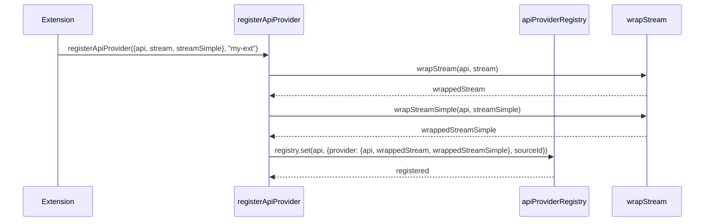
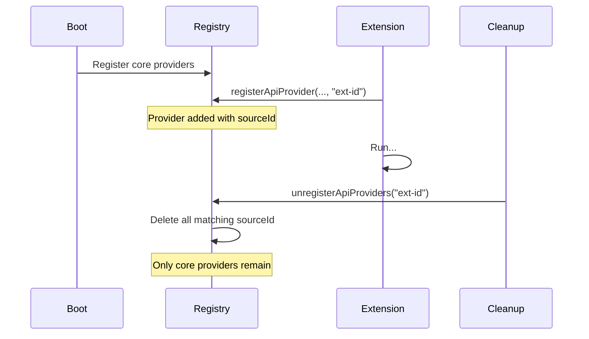
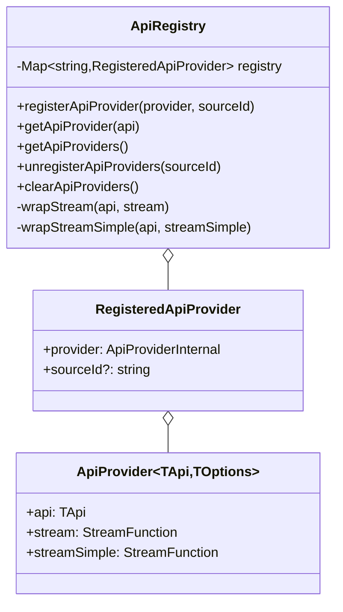

# api-registry.ts

> Auto-generated documentation for `packages/ai/src/api-registry.ts`

## Overview

Provider registry for the pi-ai package. Implements a modular API provider system where each LLM provider registers its streaming functions. Enables runtime provider registration, source attribution for unloading, and type-safe wrapper functions that validate model API compatibility.

## Dependencies

| Import | Purpose |
|--------|---------|
| `./types.js` | All type definitions including `Api`, `AssistantMessageEventStream`, `Model`, `StreamFunction` |

## API / Exports

### Provider Interface

**`ApiProvider<TApi, TOptions>`** - Provider registration interface

```typescript
interface ApiProvider<TApi extends Api, TOptions extends StreamOptions> {
  api: TApi;
  stream: StreamFunction<TApi, TOptions>;
  streamSimple: StreamFunction<TApi, SimpleStreamOptions>;
}
```

**`ApiStreamFunction`** / **`ApiStreamSimpleFunction`** - Internal wrapped function types

```typescript
type ApiStreamFunction = (
  model: Model<Api>,
  context: Context,
  options?: StreamOptions
) => AssistantMessageEventStream;
```

### Registration

**`registerApiProvider(provider, sourceId?)`** - Register a streaming provider

```typescript
function registerApiProvider<TApi extends Api, TOptions extends StreamOptions>(
  provider: ApiProvider<TApi, TOptions>,
  sourceId?: string
): void
```

Registers a provider that implements both `stream` and `streamSimple` for a specific API. The optional `sourceId` attribute enables bulk unregistration (used by extensions).

**Example:**
```typescript
import { registerApiProvider } from "@mariozechner/pi-ai";

registerApiProvider({
  api: "custom-api",
  stream: (model, context, options) => {
    // Implementation
  },
  streamSimple: (model, context, options) => {
    // Simplified implementation
  }
}, "my-extension");
```

### Query

**`getApiProvider(api)`** - Look up registered provider

```typescript
function getApiProvider(api: Api): ApiProviderInternal | undefined
```

Returns the internal provider object if registered, `undefined` otherwise.

**`getApiProviders()`** - Get all registered providers

```typescript
function getApiProviders(): ApiProviderInternal[]
```

Returns array of all registered providers. Order is insertion order from `Map`.

### Unregistration

**`unregisterApiProviders(sourceId)`** - Bulk unregistration

```typescript
function unregisterApiProviders(sourceId: string): void
```

Removes all providers registered with the given `sourceId`. Used by extension system to clean up when extensions reload.

**`clearApiProviders()`** - Clear entire registry

```typescript
function clearApiProviders(): void
```

Removes all providers. Useful for testing or resetting state.

## Internal Details

### Registry Storage

```typescript
const apiProviderRegistry = new Map<string, RegisteredApiProvider>();

type RegisteredApiProvider = {
  provider: ApiProviderInternal;
  sourceId?: string;  // For bulk cleanup
};
```

### Function Wrapping

Provider functions are wrapped with API validation:

```typescript
function wrapStream<TApi extends Api, TOptions extends StreamOptions>(
  api: TApi,
  stream: StreamFunction<TApi, TOptions>
): ApiStreamFunction {
  return (model, context, options) => {
    if (model.api !== api) {
      throw new Error(`Mismatched api: ${model.api} expected ${api}`);
    }
    return stream(model as Model<TApi>, context, options as TOptions);
  };
}
```

This ensures:
- Runtime validation that model's declared API matches provider
- Type casting for TypeScript narrowing
- Consistent `AssistantMessageEventStream` return type

### Extension Integration

The `sourceId` parameter enables:
1. Extensions to register custom providers with their own identifier
2. Clean unregistration when extension reloads via `unregisterApiProviders("extension-id")`
3. No interference with core providers (which typically don't use `sourceId`)

## UML Diagrams

### Provider Registration Flow



### API Routing

```mermaid
flowchart LR
    Stream[stream() call] --> getApiProvider
    getApiProvider --> Registry{registry.get(api)}
    Registry -->|found| Provider[Provider Impl]
    Registry -->|not found| Error[throw Error]
    
    Provider --> Validate[wrapStream validates]
    Validate --> Return[Return stream]
```

### Extension Lifecycle



### Class Structure


