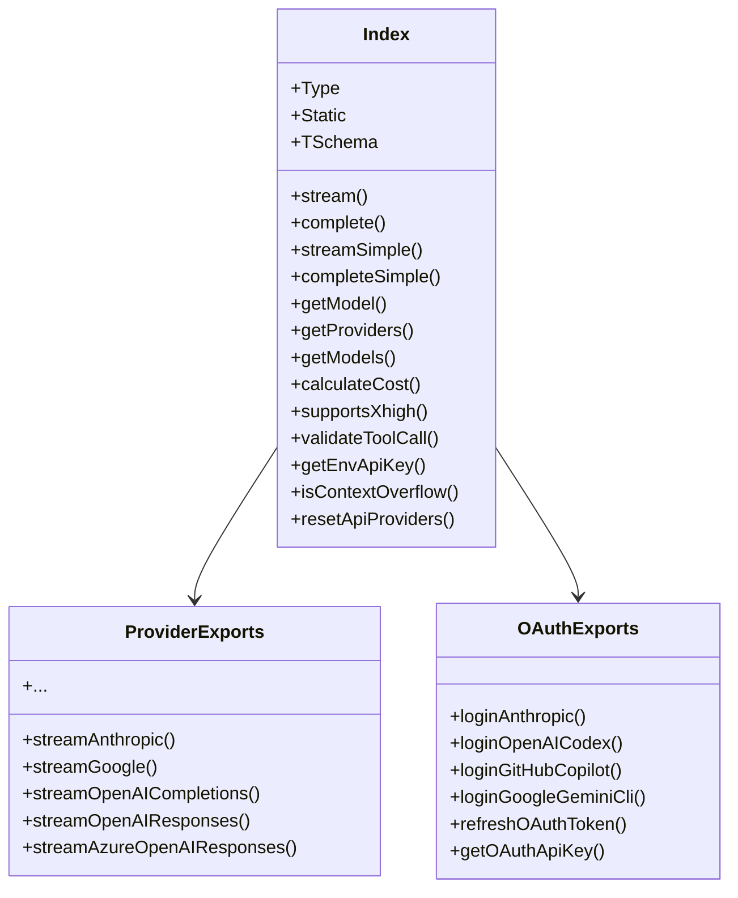

# index.ts

> Auto-generated documentation for `packages/ai/src/index.ts`

## Overview

Main entry point for the `@mariozechner/pi-ai` package. Acts as a barrel export file that re-exports all public APIs from submodules. Provides unified access to LLM streaming, model management, OAuth utilities, and type-safe validation helpers.

## Dependencies

| Import | Purpose |
|--------|---------|
| `@sinclair/typebox` | JSON Schema validation library re-exported for tool definitions |
| `./api-registry.js` | API provider registration system |
| `./env-api-keys.js` | Environment variable API key detection |
| `./models.js` | Model registry and lookup functions |
| `./providers/*.js` | LLM provider implementations (Anthropic, OpenAI, Google, etc.) |
| `./stream.js` | High-level streaming functions (`stream`, `complete`, etc.) |
| `./types.js` | Core type definitions |
| `./utils/*.js` | Utility modules (event stream, JSON parsing, OAuth, validation) |

## API / Exports

### TypeBox Re-exports
- `Type` - TypeBox schema builder for tool parameter definitions
- `Static` - TypeScript type extraction from schemas  
- `TSchema` - Base schema type

### Core API Functions
Re-exported from `./stream.js`:
- `stream(model, context, options)` - Streaming LLM request with provider-specific options
- `complete(model, context, options)` - Promise-based completion
- `streamSimple(model, context, options)` - Unified streaming with simplified options
- `completeSimple(model, context, options)` - Unified completion with simplified options

### Model Management
Re-exported from `./models.js`:
- `getModel(provider, modelId)` - Type-safe model lookup
- `getProviders()` - List all available providers
- `getModels(provider)` - List models for a provider
- `calculateCost(model, usage)` - Calculate token costs
- `supportsXhigh(model)` - Check if model supports xhigh thinking level
- `modelsAreEqual(a, b)` - Compare two models

### Provider Implementations
- `streamAnthropic` / `AnthropicOptions` - Anthropic Messages API
- `streamGoogle` / `GoogleOptions` - Google Generative AI API  
- `streamOpenAICompletions` / `OpenAICompletionsOptions` - OpenAI-compatible APIs
- `streamOpenAIResponses` / `OpenAIResponsesOptions` - OpenAI Responses API
- `streamAzureOpenAIResponses` / `AzureOpenAIResponsesOptions` - Azure OpenAI
- Plus utilities from `register-builtins.js` for provider auto-registration

### OAuth Utilities
From `./utils/oauth/index.js`:
- `loginAnthropic`, `loginOpenAICodex`, `loginGitHubCopilot`, etc.
- `refreshOAuthToken` - Refresh expired tokens
- `getOAuthApiKey` - Get API key from OAuth credentials
- OAuth credential types

### Validation & Utilities
- `validateToolCall` - Validate tool arguments against schemas
- `EventStream` - Event streaming wrapper
- `parseJSONObject` / `parseStreamingJSONObject` - JSON parsing utilities
- `getEnvApiKey` - Detect API keys from environment
- `isContextOverflow` - Check error for context overflow
- `resetApiProviders` - Clear provider registry
- `StringEnum` - TypeBox helper for string enums

## Internal Details

This file uses ES module syntax with `.js` extensions (required for Node.js ESM compatibility). The module structure:

1. **TypeBox exports first** - Ensures schema builders are available before other imports
2. **Core API exports** - Registry, models, and streaming
3. **Provider-specific exports** - Individual provider functions for advanced use
4. **Utility exports** - Helper functions and OAuth

The namespace is carefully designed to prevent naming conflicts between providers. Each provider exports its `stream<Provider>` function with a unique prefix.

## UML Diagrams

### Module Dependency Diagram

```mermaid
graph TD
    index[index.ts] --> TypeBox[@sinclair/typebox]
    index --> api[api-registry]
    index --> env[env-api-keys]
    index --> models[models]
    index --> stream[stream]
    index --> types[types]
    index --> providers[providers/*]
    index --> utils[utils/*]
    
    stream --> api
    stream --> providers
    models --> types
    providers --> types
    utils/oauth --> types
```

### Package Export Structure


