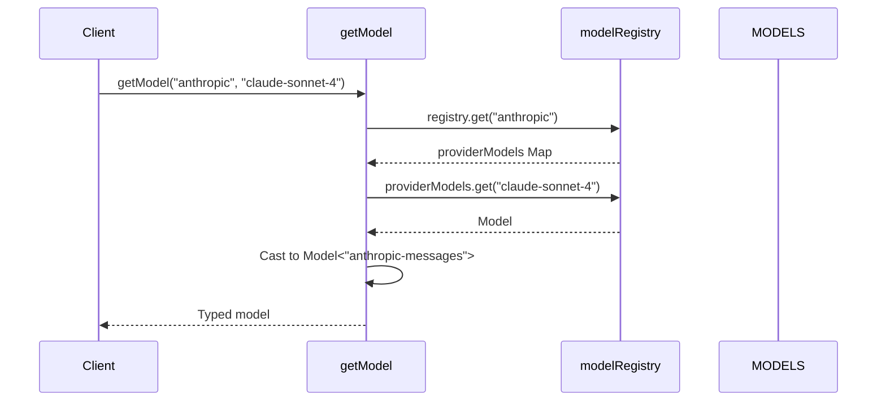

```mermaid
flowchart TD
    Input[Input Tokens] --> Calc
    Output[Output Tokens] --> Calc
    CacheRead[Cache Read Tokens] --> Calc
    CacheWrite[Cache Write Tokens] --> Calc
    
    Calc[calculateCost] --> ApplyRates[Apply $/million rates]
    ApplyRates --> Sum[Sum all costs]
    Sum --> Result[usage.cost.total]
    
    style Calc fill:#2d3748,stroke:#4a5568
    style Result fill:#22543d,stroke:#276749
```

# models.ts

> Auto-generated documentation for `packages/ai/src/models.ts`

## Overview

Model registry for the pi-ai package. Manages a Map-based registry of all available models, populated from the generated `models.generated.ts` data. Provides type-safe model lookup via `getModel()`, provider/model enumeration, cost calculation, and model capability detection.

## Dependencies

| Import | Purpose |
|--------|---------|
| `./models.generated.js` | `MODELS` - Auto-generated model data from provider APIs |
| `./types.js` | `Api`, `KnownProvider`, `Model`, `Usage` |

## API / Exports

### Model Lookup

**`getModel(provider, modelId)`** - Type-safe model retrieval

```typescript
function getModel<
  TProvider extends KnownProvider,
  TModelId extends keyof (typeof MODELS)[TProvider]
>(
  provider: TProvider,
  modelId: TModelId
): Model<ModelApi<TProvider, TModelId>>
```

Returns a fully typed `Model` instance with the correct `api` field based on the provider and model ID. Supports IDE autocomplete for both provider names and model IDs.

**Example:**
```typescript
import { getModel, stream } from "@mariozechner/pi-ai";

// Fully typed - TypeScript knows this is an Anthropic model
const model = getModel("anthropic", "claude-sonnet-4-20250514");
// model.api === "anthropic-messages"
// model.provider === "anthropic"
```

**`getProviders()`** - List all registered providers

```typescript
function getProviders(): KnownProvider[]
```

Returns array of provider names as defined in `MODELS` (e.g., `["openai", "anthropic", "google"]`)

**`getModels(provider)`** - List models for a provider

```typescript
function getModels<TProvider extends KnownProvider>(
  provider: TProvider
): Model<ModelApi<TProvider, keyof (typeof MODELS)[TProvider]>>[]
```

Returns all models for the given provider with proper API typing.

### Cost Calculation

**`calculateCost(model, usage)`** - Calculate monetary cost

```typescript
function calculateCost<TApi extends Api>(
  model: Model<TApi>,
  usage: Usage
): Usage["cost"]
```

Computes costs from token counts using the model's `cost` rates (per-million tokens):

```typescript
usage.cost.input = (model.cost.input / 1_000_000) * usage.input;
usage.cost.output = (model.cost.output / 1_000_000) * usage.output;
// ... plus cacheRead, cacheWrite
usage.cost.total = sum of all
```

Populates the `usage.cost` object in place and returns it.

### Capability Detection

**`supportsXhigh(model)`** - Check xhigh thinking support

```typescript
function supportsXhigh<TApi extends Api>(model: Model<TApi>): boolean
```

Returns `true` if model supports `xhigh` thinking level:
- OpenAI GPT-5.2 / GPT-5.3 model families
- Anthropic Messages API Opus 4.5/4.6 models

**`modelsAreEqual(a, b)`** - Compare models

```typescript
function modelsAreEqual<TApi extends Api>(
  a: Model<TApi> | null | undefined,
  b: Model<TApi> | null | undefined
): boolean
```

Safe comparison that returns `false` if either model is nullish, otherwise compares by `id` and `provider`.

## Internal Details

### Registry Initialization

```typescript
const modelRegistry: Map<string, Map<string, Model<Api>>> = new Map();

// Initialize from MODELS on module load
for (const [provider, models] of Object.entries(MODELS)) {
  const providerModels = new Map<string, Model<Api>>();
  for (const [id, model] of Object.entries(models)) {
    providerModels.set(id, model as Model<Api>);
  }
  modelRegistry.set(provider, providerModels);
}
```

The registry is a nested Map: `provider → modelId → Model`

### Type-Level Model API Extraction

The `ModelApi` type uses conditional types to extract the API from the generated data:

```typescript
type ModelApi<TProvider, TModelId> = 
  (typeof MODELS)[TProvider][TModelId] extends { api: infer TApi }
    ? (TApi extends Api ? TApi : never)
    : never;
```

This enables `getModel("openai", "gpt-4o-mini").api` to be typed as `"openai-responses"`.

### Dynamic Provider Support

While `getModel` requires `KnownProvider` for type safety, the underlying registry accepts any string provider name. Custom providers can be registered at runtime via `registerApiProvider`.

## UML Diagrams

### Registry Structure

```mermaid
classDiagram
    class ModelRegistry {
        -Map~string, Map~string, Model~~ registry~
        +getModel(provider, modelId) Model
        +getProviders() string[]
        +getModels(provider) Model[]
        +calculateCost(model, usage) Cost
    }
    
    class MODELS~generated~ {
        +openai: { gpt-4o, gpt-4o-mini }
        +anthropic: { claude-sonnet-4, claude-opus-4 }
        +google: { gemini-2.5-flash }
    }
    
    class Model~TApi~ {
        +id: string
        +name: string
        +api: TApi
        +provider: Provider
        +cost: TokenCost
        +contextWindow: number
    }
    
    ModelRegistry o-- Model
    ModelRegistry --> MODELS~generated~ : populates from
```

### Model Lookup Flow



### Cost Calculation


