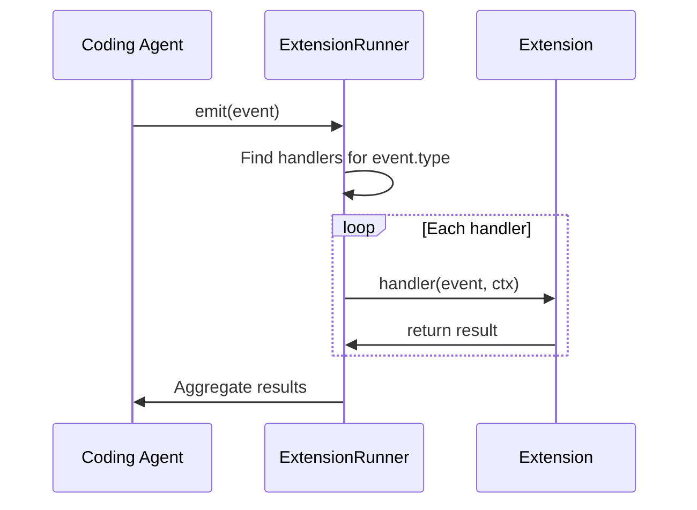
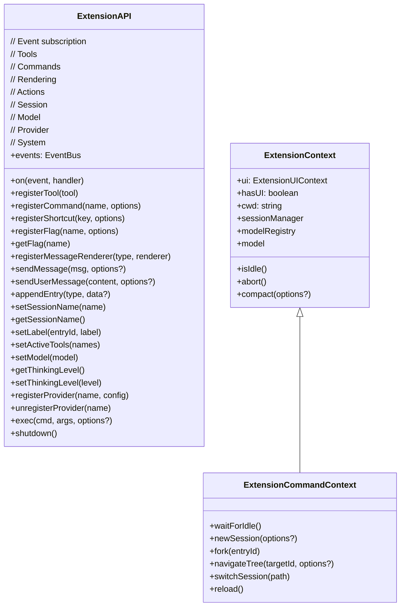

# types.ts

> Auto-generated documentation for `packages/coding-agent/src/core/extensions/types.ts`

## Overview

Complete type definitions for the extension system. Defines the ExtensionAPI interface, event system, tool registration, command registration, UI contexts, and all extension lifecycle hooks. This is the contract between extensions and the coding-agent.

## Dependencies

| Import | Purpose |
|--------|---------|
| `@mariozechner/pi-agent-core` | Agent types, tool types |
| `@mariozechner/pi-ai` | LLM streaming types, OAuth types |
| `@mariozechner/pi-tui` | TUI component types |
| `@sinclair/typebox` | Schema types |
| `../exec.js` | `ExecOptions`, `ExecResult` |
| `../keybindings.js` | `KeybindingsManager`, `AppAction` |
| `../messages.js` | `CustomMessage` |
| `../session-manager.js` | Session types |
| `../slash-commands.js` | `SlashCommandInfo` |

## API / Exports

### Event System

**`ExtensionEvent`** - Union of all event types:
- Resources: `resources_discover`
- Session: `session_start`, `session_before_switch`, `session_switch`, `session_before_fork`, `session_fork`, `session_before_compact`, `session_compact`, `session_shutdown`, `session_before_tree`, `session_tree`
- Context: `context`, `before_agent_start`
- Agent lifecycle: `agent_start`, `agent_end`, `turn_start`, `turn_end`
- Messages: `message_start`, `message_update`, `message_end`
- Tools: `tool_execution_start`, `tool_execution_update`, `tool_execution_end`, `tool_call`, `tool_result`
- Model: `model_select`
- User: `user_bash`, `input`

**`ExtensionHandler<E, R>`** - Handler function type:

```typescript
type ExtensionHandler<E, R> = (event: E, ctx: ExtensionContext) => Promise<R | void> | R | void;
```

### ExtensionAPI

Main API passed to extension factory functions.

**Event Subscription:**
```typescript
on(event, handler): void
```

Supported events and result types:
- `on("resources_discover", handler)` - Returns `ResourcesDiscoverResult`
- `on("session_start", handler)` - No result
- `on("session_before_switch", handler)` - Returns `SessionBeforeSwitchResult` (cancel?)
- `on("session_before_fork", handler)` - Returns `SessionBeforeForkResult` (cancel?, skipConversationRestore?)
- `on("session_before_compact", handler)` - Returns `SessionBeforeCompactResult` (cancel?, compaction?)
- `on("context", handler)` - Returns `ContextEventResult` (messages?)
- `on("before_agent_start", handler)` - Returns `BeforeAgentStartEventResult` (message?, systemPrompt?)
- `on("tool_call", handler)` - Returns `ToolCallEventResult` (block?, reason?)
- `on("tool_result", handler)` - Returns `ToolResultEventResult` (content?, details?, isError?)
- `on("user_bash", handler)` - Returns `UserBashEventResult` (operations?, result?)
- And more...

**Tool Registration:**
```typescript
registerTool<TParams, TDetails>(tool: ToolDefinition<TParams, TDetails>): void
```

**Command Registration:**
```typescript
registerCommand(name, options: {
  description?: string;
  getArgumentCompletions?: (argPrefix) => AutocompleteItem[] | null;
  handler: (args, ctx: ExtensionCommandContext) => Promise<void>;
}): void
```

**Shortcut Registration:**
```typescript
registerShortcut(shortcut: KeyId, options: {
  description?: string;
  handler: (ctx: ExtensionContext) => Promise<void> | void;
}): void
```

**Flag Registration:**
```typescript
registerFlag(name, options: {
  description?: string;
  type: "boolean" | "string";
  default?: boolean | string;
}): void

getFlag(name): boolean | string | undefined
```

**Message Rendering:**
```typescript
registerMessageRenderer<T>(customType: string, renderer: MessageRenderer<T>): void
```

**Send Methods:**
```typescript
sendMessage<T>(message, options?): void  // Custom message
sendUserMessage(content, options?): void      // User message
appendEntry<T>(customType, data?): void    // Append to session (no LLM)
```

**Session Metadata:**
```typescript
setSessionName(name): void
getSessionName(): string | undefined
setLabel(entryId, label): void
```

**System:**
```typescript
exec(command, args, options?): Promise<ExecResult>
shutdown(): void  // Exit pi
```

**Tools:**
```typescript
getActiveTools(): string[]
getAllTools(): ToolInfo[]
setActiveTools(toolNames: string[])
getCommands(): SlashCommandInfo[]
```

**Model:**
```typescript
setModel(model): Promise<boolean>  // Returns false if no API key
getThinkingLevel(): ThinkingLevel
setThinkingLevel(level): void
```

**Provider Registration:**
```typescript
registerProvider(name: string, config: ProviderConfig): void
unregisterProvider(name: string): void
```

**Events:**
```typescript
events: EventBus  // Shared event bus
```

### ExtensionContext

Base context passed to event handlers:

```typescript
interface ExtensionContext {
  ui: ExtensionUIContext;           // UI methods (if available)
  hasUI: boolean;                   // Is UI available
  cwd: string;                      // Working directory
  sessionManager: ReadonlySessionManager;
  modelRegistry: ModelRegistry;
  model: Model<any> | undefined;
  
  isIdle(): boolean;
  abort(): void;
  hasPendingMessages(): boolean;
  shutdown(): void;
  getContextUsage(): ContextUsage | undefined;
  compact(options?): void;
  getSystemPrompt(): string;
}
```

### ExtensionCommandContext

Extended context for command handlers (includes session control):

```typescript
interface ExtensionCommandContext extends ExtensionContext {
  waitForIdle(): Promise<void>;
  newSession(options?): Promise<{ cancelled: boolean }>;
  fork(entryId): Promise<{ cancelled: boolean }>;
  navigateTree(targetId, options?): Promise<{ cancelled: boolean }>;
  switchSession(sessionPath): Promise<{ cancelled: boolean }>;
  reload(): Promise<void>;
}
```

### UI Context

**`ExtensionUIContext`** - Methods for UI interaction:

```typescript
interface ExtensionUIContext {
  select(title, options, opts?): Promise<string | undefined>
  confirm(title, message, opts?): Promise<boolean>
  input(title, placeholder?, opts?): Promise<string | undefined>
  notify(message, type?): void  // "info" | "warning" | "error"
  onTerminalInput(handler): () => void
  setStatus(key, text): void
  setWorkingMessage(message?): void
  
  // Widgets
  setWidget(key, content, options?): void
  setFooter(factory): void
  setHeader(factory): void
  setTitle(title): void
  
  // Custom UI
  custom<T>(factory, options?): Promise<T>
  
  // Editor
  pasteToEditor(text): void
  setEditorText(text): void
  getEditorText(): string
  editor(title, prefill?): Promise<string | undefined>
  setEditorComponent(factory): void
  
  // Theme
  readonly theme: Theme
  getAllThemes(): Array<{ name, path }>
  getTheme(name): Theme | undefined
  setTheme(theme): { success, error? }
  
  // Tools
  getToolsExpanded(): boolean
  setToolsExpanded(expanded): void
}
```

### Tool Definition

**`ToolDefinition<TParams, TDetails>`**:

```typescript
interface ToolDefinition<TParams extends TSchema, TDetails> {
  name: string;           // LLM-visible name
  label: string;          // Human-readable
  description: string;    // LLM-visible
  parameters: TParams;    // TypeBox schema
  
  execute: (
    toolCallId: string,
    params: Static<TParams>,
    signal: AbortSignal | undefined,
    onUpdate: AgentToolUpdateCallback<TDetails> | undefined,
    ctx: ExtensionContext
  ) => Promise<AgentToolResult<TDetails>>;
  
  // Optional renderers
  renderCall?(args, theme): Component;
  renderResult?(result, options, theme): Component;
}
```

### Provider Registration

**`ProviderConfig`**:

```typescript
interface ProviderConfig {
  baseUrl?: string;           // API endpoint
  apiKey?: string;            // Or env var name
  api?: Api;                  // API type
  streamSimple?: StreamFn;   // Custom stream handler
  headers?: Record<string, string>;
  authHeader?: boolean;       // Add Bearer header
  models?: ProviderModelConfig[];
  oauth?: {
    name: string;
    login(callbacks): Promise<OAuthCredentials>;
    refreshToken(credentials): Promise<OAuthCredentials>;
    getApiKey(credentials): string;
    modifyModels?(models, credentials): Model[];
  };
}
```

## UML Diagrams

### Extension Event Flow



### ExtensionAPI Structure



### Tool Registration Flow

```mermaid
sequenceDiagram
    participant Ext as Extension
    participant API as ExtensionAPI
    participant Runner as ExtensionRunner
    
    Ext->>API: registerTool(definition)
    API->>Runner: Store in _tools Map
    
    Later: Agent calls tool
    Agent->>Runner: Lookup tool by name
    Runner->>Runner: execute(toolCallId, params, signal, onUpdate, ctx)
    Runner->>Runner: Check tool_call handlers
    Runner-->>Agent: AgentToolResult
```
