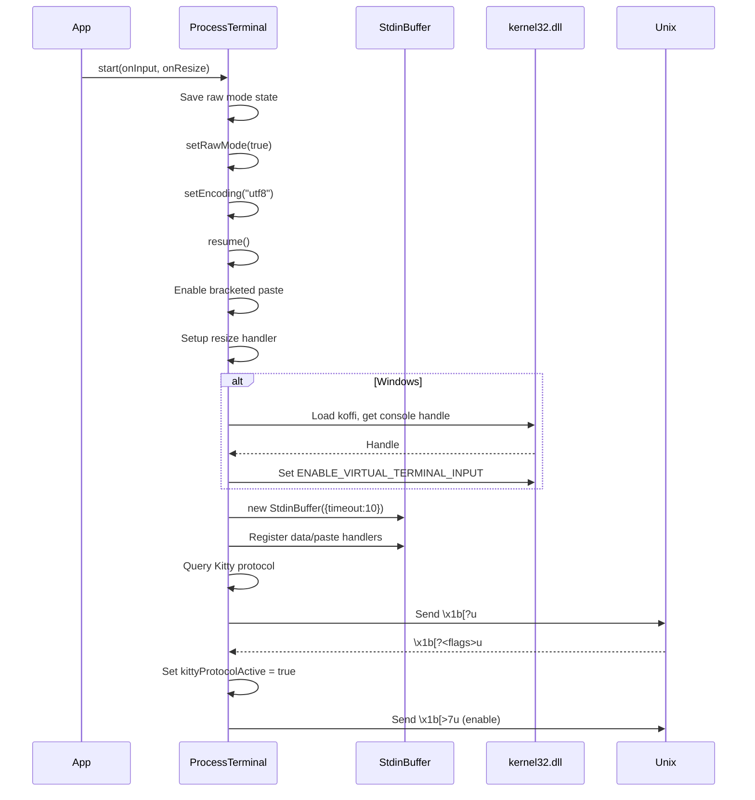
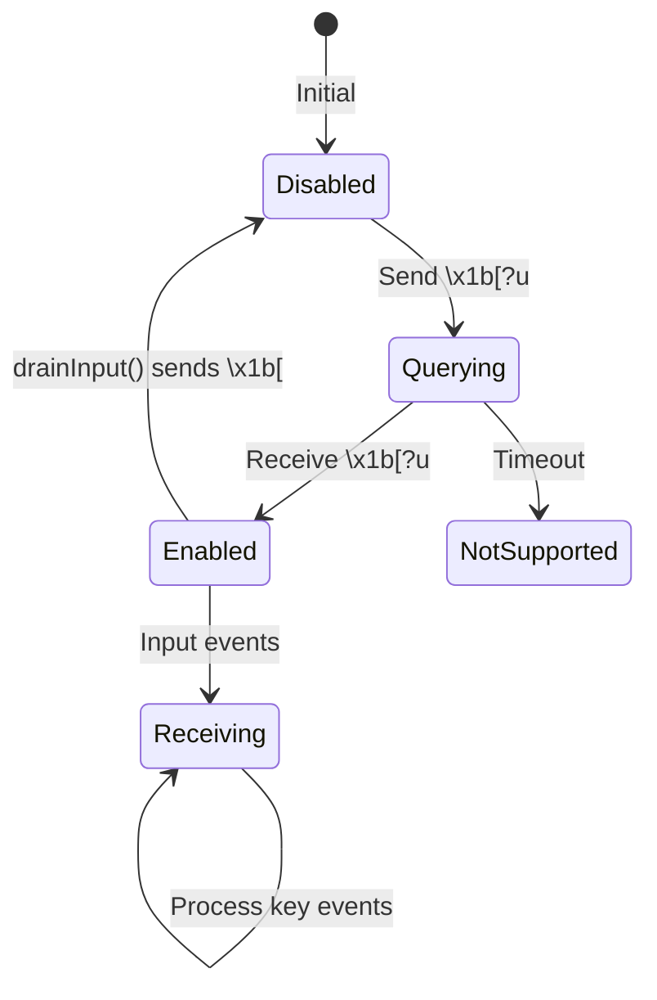

# terminal.ts

> Auto-generated documentation for `packages/tui/src/terminal.ts`

## Overview

Terminal abstraction providing a cross-platform interface for process.stdin/stdout interaction. Manages raw mode, Kitty keyboard protocol detection/enabling, bracketed paste mode, and Windows VT input support. Handles cleanup on stop and drains input before exit to prevent key event leakage.

## Dependencies

| Import | Purpose |
|--------|---------|
| `node:fs` | Debug logging (PI_TUI_WRITE_LOG) |
| `node:module` | createRequire for optional koffi loading |
| `./keys.js` | `setKittyProtocolActive` |
| `./stdin-buffer.js` | `StdinBuffer` for input parsing |

## API / Exports

### Terminal Interface

**`Terminal`** - Abstract terminal interface

```typescript
interface Terminal {
  // Lifecycle
  start(onInput: (data: string) => void, onResize: () => void): void;
  stop(): void;
  drainInput(maxMs?: number, idleMs?: number): Promise<void>;
  
  // Output
  write(data: string): void;
  
  // Dimensions
  get columns(): number;
  get rows(): number;
  
  // Protocol state
  get kittyProtocolActive(): boolean;
  
  // Cursor movement
  moveBy(lines: number): void;
  hideCursor(): void;
  showCursor(): void;
  
  // Clearing
  clearLine(): void;
  clearFromCursor(): void;
  clearScreen(): void;
  
  // Title
  setTitle(title: string): void;
}
```

### ProcessTerminal

**`ProcessTerminal`** - Real terminal implementation

```typescript
class ProcessTerminal implements Terminal {
  constructor();
  
  // Write debugging via PI_TUI_WRITE_LOG
  get kittyProtocolActive(): boolean;
  
  // All Terminal interface methods
}
```

### Lifecycle Methods

**`start(onInput, onResize)`**
1. Save previous raw mode state
2. Enable raw mode (`process.stdin.setRawMode(true)`)
3. Set UTF-8 encoding
4. Resume stdin
5. Enable bracketed paste mode (`\x1b[?2004h`)
6. Set up resize handler
7. Refresh dimensions via SIGWINCH (Unix)
8. Enable Windows VT input (Windows only, via koffi)
9. Query and enable Kitty keyboard protocol

**`stop()`**
1. Disable bracketed paste (`\x1b[?2004l`)
2. Disable Kitty protocol (`\x1b[<u`)
3. Destroy StdinBuffer
4. Remove event handlers
5. Pause stdin
6. Restore raw mode state

**`drainInput(maxMs?, idleMs?)`**
- Wait for pending input to drain before exit
- Prevents Kitty release events from leaking to parent shell
- Returns early if idle for `idleMs` ms or after `maxMs`

### Query and Protocol Methods

**`queryAndEnableKittyProtocol()`**
- Sends `\x1b[?u` to query current flags
- On response `\x1b[?<flags>u`, enables protocol with `\x1b[>7u`
- Flags: 1 (disambiguate) + 2 (event types) + 4 (alternate keys)

**`enableWindowsVTInput()`**
- Dyanamically requires koffi (keeps binary small on other platforms)
- Uses kernel32.dll to enable `ENABLE_VIRTUAL_TERMINAL_INPUT`
- Required for Shift+Tab and other modified keys on Windows

### Dimensions

- `columns` - `process.stdout.columns || 80`
- `rows` - `process.stdout.rows || 24`

### Escape Sequences

| Method | Sequence | Description |
|--------|----------|-------------|
| `moveBy(n)` | `\x1b[nA/B` | Move up/down n lines |
| `hideCursor()` | `\x1b[?25l` | Hide cursor |
| `showCursor()` | `\x1b[?25h` | Show cursor |
| `clearLine()` | `\x1b[K` | Clear to end of line |
| `clearFromCursor()` | `\x1b[J` | Clear from cursor to end |
| `clearScreen()` | `\x1b[2J\x1b[H` | Clear screen + home |
| `setTitle(s)` | `\x1b]0;s\x07` | Set window title |

## Internal Details

### StdinBuffer Setup

```typescript
private setupStdinBuffer(): void {
  this.stdinBuffer = new StdinBuffer({ timeout: 10 });
  
  // Detect Kitty protocol response
  this.stdinBuffer.on("data", (sequence) => {
    const match = sequence.match(/^\x1b\[(\d+)u$/);
    if (match) {
      this._kittyProtocolActive = true;
      setKittyProtocolActive(true);
      process.stdout.write("\x1b[>7u");  // Enable
      return;
    }
    // Forward to input handler
  });
  
  // Wrap paste content
  this.stdinBuffer.on("paste", (content) => {
    this.inputHandler?.(`\x1b[200~${content}\x1b[201~`);
  });
}
```

### Windows VT Input

Only runs on `process.platform === "win32"`:
- Locates koffi via `createRequire`
- Loads kernel32.dll functions: `GetStdHandle`, `GetConsoleMode`, `SetConsoleMode`
- Sets `ENABLE_VIRTUAL_TERMINAL_INPUT` (0x0200) flag
- Silently fails if koffi unavailable

### Input Draining

```typescript
async drainInput(maxMs = 1000, idleMs = 50): Promise<void> {
  // Disable Kitty protocol first
  // Remove normal input handler
  // Monitor for new data
  // Return when idle or timeout
}
```

Used before exit to ensure no pending key release events leak.

## UML Diagrams

### Startup Sequence



### Kitty Protocol State Machine



### Input Flow

```mermaid
flowchart LR
    Raw[Raw stdin] --> StdinBuffer
    StdinBuffer -- data --> DataHandler{Kitty response?}
    DataHandler --|yes| EnableKitty[Enable protocol]
    DataHandler --|no| InputHandler[onInput callback]
    
    StdinBuffer -- paste --> PasteHandler[Wrap with markers]
    PasteHandler --> InputHandler
```
