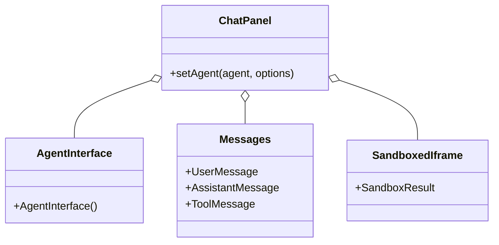
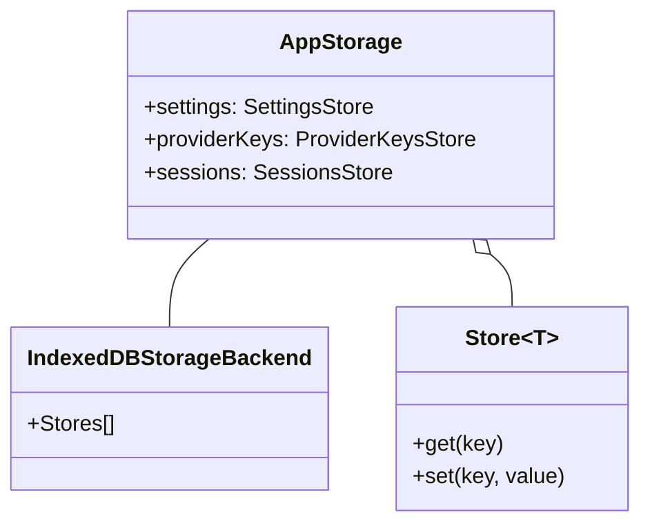
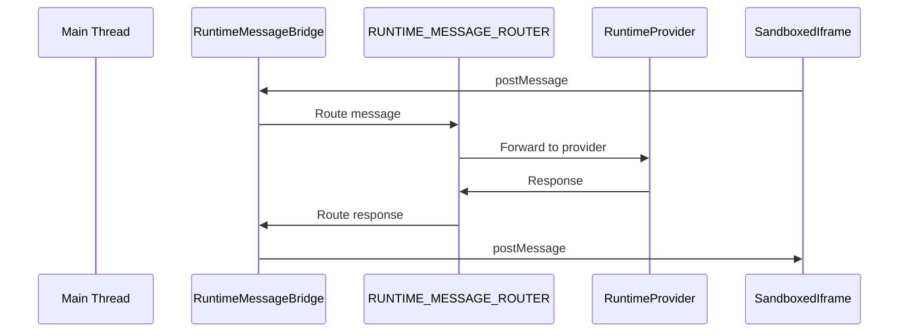

# index.ts

> Auto-generated documentation for `packages/web-ui/src/index.ts`

## Overview

Main entry point for the `@mariozechner/pi-web-ui` package. Exports web components for building AI chat interfaces powered by pi-ai and pi-agent-core. Includes chat panels, message components, dialogs, storage backends, sandbox providers, tool renderers, and utilities.

## Dependencies

| Import | Purpose |
|--------|---------|
| `@mariozechner/pi-agent-core` | `Agent`, `AgentMessage`, `AgentState`, `ThinkingLevel` |
| `@mariozechner/pi-ai` | `Model` |

## API / Exports

### Main Components

**`ChatPanel`** - Complete chat interface component

```typescript
import { ChatPanel } from "@mariozechner/pi-web-ui";

const panel = new ChatPanel();
await panel.setAgent(agent, options);
document.body.appendChild(panel);
```

### Agent Components

**`AgentInterface`** - Message history with input

**`Messages`** - Component exports:
- `AssistantMessage`, `UserMessage`, `ToolMessage`
- `AbortedMessage`, `ToolMessageDebugView`
- `isArtifactMessage()`, `isUserMessageWithAttachments()`
- `convertAttachments()`, `defaultConvertToLlm()`

### Chat Components

**`MessageList`** - Scrollable message list

**`StreamingMessageContainer`** - Container for streaming content

**`ThinkingBlock`** - Display reasoning/thinking content

**`AttachmentTile`** - File attachment display

**`ConsoleBlock`** - Console output display

**`CustomProviderCard`** - Custom provider configuration card

**`ExpandableSection`** - Collapsible content sections

**`Input`** - Text input component

**`MessageEditor`** - Message content editor

**`SandBoxedIframe`** - Sandboxed iframe for artifacts

**`ProviderKeyInput`** - API key input widget

### Dialogs

**`ModelSelector`** - Model selection dialog

**`ApiKeyPromptDialog`** - OAuth/API key prompting

**`SessionListDialog`** - Session management dialog

**`PersistentStorageDialog`** - Storage permission dialog

**`ProvidersModelsTab`** - Settings tab for provider/model config

**`SettingsDialog`** - Main settings (with tabs: `SettingsTab`, `ApiKeysTab`, `ProxyTab`)

**`AttachmentOverlay`** - Full-screen attachment viewer

### Sandbox Runtime Providers

**`RuntimeMessageBridge`** - Communication between sandbox and main thread

**`RUNTIME_MESSAGE_ROUTER`** - Message routing system

**`ArtifactsRuntimeProvider`** - Artifact file access provider

**`AttachmentsRuntimeProvider`** - Attachment access provider

**`ConsoleRuntimeProvider`** - Console capture for sandbox

**`FileDownloadRuntimeProvider`** - File download from sandbox

### Artifacts

**`ArtifactsPanel`** - Display HTML/JS artifacts

**`ArtifactElement`** - Base component for artifact rendering

**`ArtifactPill`** - Artifact type indicator

Artifact types:
- `HtmlArtifact`, `SvgArtifact`, `MarkdownArtifact`, `TextArtifact`
- `ImageArtifact`
- `DocxArtifact`, `ExcelArtifact`, `PdfArtifact` (document extraction)
- `GenericArtifact` (fallback)

**`ArtifactsToolRenderer`** - Renders artifacts from tool calls

### Storage

**`AppStorage`** - Application storage coordinator

**`setAppStorage()` / `getAppStorage()` - Global storage singleton

**`IndexedDBStorageBackend`** - IndexedDB persistence

**Store implementations:**
- `SettingsStore` - User settings
- `ProviderKeysStore` - API keys
- `SessionsStore` - Chat session data
- `CustomProvidersStore` - Custom provider definitions

**Storage types:**
- `StorageBackend`, `StorageTransaction`, `StoreConfig`
- `IndexConfig`, `IndexedDBConfig`
- `SessionData`, `SessionMetadata`

### Tools

**`createJavaScriptReplTool()`** - JavaScript REPL tool factory

**`javascriptReplTool`** - Default JS REPL tool

**`createExtractDocumentTool()`** - Document extraction tool

**`extractDocumentTool`** - Default extraction tool

### Tool Renderers

**`renderTool()`** / **`registerToolRenderer()`** / **`getToolRenderer()`**

Built-in renderers:
- `DefaultRenderer`
- `BashRenderer`
- `CalculateRenderer`
- `GetCurrentTimeRenderer`

Renderer types:
- `ToolRenderer`, `ToolRenderResult`

**Header rendering:**
- `renderHeader()`, `renderCollapsibleHeader()`

### Utilities

**`loadAttachment()`** - Load file attachments

**`getAuthToken()` / `clearAuthToken()`** - Auth token management

**Formatting:**
- `formatCost()`, `formatModelCost()`
- `formatTokenCount()`, `formatUsage()`

**`i18n`** / **`setLanguage()`** / **`translations`** - Internationalization

**Proxy:**
- `applyProxyIfNeeded()`
- `createStreamFn()`
- `isCorsError()`
- `shouldUseProxyForProvider()`

### Message Renderer System

**`registerMessageRenderer()`** / **`getMessageRenderer()`** / **`renderMessage()`**

Types:
- `MessageRenderer`
- `MessageRole`

### Prompts

Constants for LLM prompts:
- `ARTIFACTS_RUNTIME_PROVIDER_DESCRIPTION_RO` (read-only)
- `ARTIFACTS_RUNTIME_PROVIDER_DESCRIPTION_RW` (read-write)
- `ATTACHMENTS_RUNTIME_DESCRIPTION`

## UML Diagrams

### Component Hierarchy



### Storage Architecture



### Sandbox Message Flow


